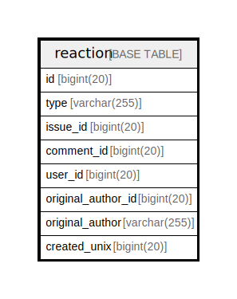

# reaction

## 概要

<details>
<summary><strong>テーブル定義</strong></summary>

```sql
CREATE TABLE `reaction` (
  `id` bigint(20) NOT NULL AUTO_INCREMENT,
  `type` varchar(255) NOT NULL,
  `issue_id` bigint(20) NOT NULL,
  `comment_id` bigint(20) DEFAULT NULL,
  `user_id` bigint(20) NOT NULL,
  `original_author_id` bigint(20) NOT NULL DEFAULT 0,
  `original_author` varchar(255) DEFAULT NULL,
  `created_unix` bigint(20) DEFAULT NULL,
  PRIMARY KEY (`id`),
  UNIQUE KEY `UQE_reaction_s` (`type`,`issue_id`,`comment_id`,`user_id`,`original_author_id`,`original_author`),
  KEY `IDX_reaction_comment_id` (`comment_id`),
  KEY `IDX_reaction_user_id` (`user_id`),
  KEY `IDX_reaction_original_author_id` (`original_author_id`),
  KEY `IDX_reaction_original_author` (`original_author`),
  KEY `IDX_reaction_created_unix` (`created_unix`),
  KEY `IDX_reaction_type` (`type`),
  KEY `IDX_reaction_issue_id` (`issue_id`)
) ENGINE=InnoDB DEFAULT CHARSET=utf8mb4 ROW_FORMAT=DYNAMIC
```

</details>

## カラム一覧

| 名前                 | タイプ          | デフォルト値       | NULL許可   | Extra Definition | 子テーブル      | 親テーブル      | コメント     |
| ------------------ | ------------ | ------------ | -------- | ---------------- | ---------- | ---------- | -------- |
| id                 | bigint(20)   |              | false    | auto_increment   |            |            |          |
| type               | varchar(255) |              | false    |                  |            |            |          |
| issue_id           | bigint(20)   |              | false    |                  |            |            |          |
| comment_id         | bigint(20)   | NULL         | true     |                  |            |            |          |
| user_id            | bigint(20)   |              | false    |                  |            |            |          |
| original_author_id | bigint(20)   | 0            | false    |                  |            |            |          |
| original_author    | varchar(255) | NULL         | true     |                  |            |            |          |
| created_unix       | bigint(20)   | NULL         | true     |                  |            |            |          |

## 制約一覧

| 名前             | タイプ         | 定義                                                                                                   |
| -------------- | ----------- | ---------------------------------------------------------------------------------------------------- |
| PRIMARY        | PRIMARY KEY | PRIMARY KEY (id)                                                                                     |
| UQE_reaction_s | UNIQUE      | UNIQUE KEY UQE_reaction_s (type, issue_id, comment_id, user_id, original_author_id, original_author) |

## INDEX一覧

| 名前                              | 定義                                                                                                               |
| ------------------------------- | ---------------------------------------------------------------------------------------------------------------- |
| IDX_reaction_comment_id         | KEY IDX_reaction_comment_id (comment_id) USING BTREE                                                             |
| IDX_reaction_created_unix       | KEY IDX_reaction_created_unix (created_unix) USING BTREE                                                         |
| IDX_reaction_issue_id           | KEY IDX_reaction_issue_id (issue_id) USING BTREE                                                                 |
| IDX_reaction_original_author    | KEY IDX_reaction_original_author (original_author) USING BTREE                                                   |
| IDX_reaction_original_author_id | KEY IDX_reaction_original_author_id (original_author_id) USING BTREE                                             |
| IDX_reaction_type               | KEY IDX_reaction_type (type) USING BTREE                                                                         |
| IDX_reaction_user_id            | KEY IDX_reaction_user_id (user_id) USING BTREE                                                                   |
| PRIMARY                         | PRIMARY KEY (id) USING BTREE                                                                                     |
| UQE_reaction_s                  | UNIQUE KEY UQE_reaction_s (type, issue_id, comment_id, user_id, original_author_id, original_author) USING BTREE |

## ER図



---

> Generated by [tbls](https://github.com/k1LoW/tbls)
