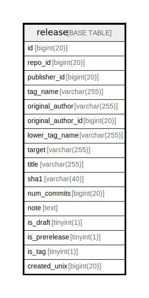

# release

## 概要

<details>
<summary><strong>テーブル定義</strong></summary>

```sql
CREATE TABLE `release` (
  `id` bigint(20) NOT NULL AUTO_INCREMENT,
  `repo_id` bigint(20) DEFAULT NULL,
  `publisher_id` bigint(20) DEFAULT NULL,
  `tag_name` varchar(255) DEFAULT NULL,
  `original_author` varchar(255) DEFAULT NULL,
  `original_author_id` bigint(20) DEFAULT NULL,
  `lower_tag_name` varchar(255) DEFAULT NULL,
  `target` varchar(255) DEFAULT NULL,
  `title` varchar(255) DEFAULT NULL,
  `sha1` varchar(40) DEFAULT NULL,
  `num_commits` bigint(20) DEFAULT NULL,
  `note` text DEFAULT NULL,
  `is_draft` tinyint(1) NOT NULL DEFAULT 0,
  `is_prerelease` tinyint(1) NOT NULL DEFAULT 0,
  `is_tag` tinyint(1) NOT NULL DEFAULT 0,
  `created_unix` bigint(20) DEFAULT NULL,
  PRIMARY KEY (`id`),
  UNIQUE KEY `UQE_release_n` (`repo_id`,`tag_name`),
  KEY `IDX_release_tag_name` (`tag_name`),
  KEY `IDX_release_original_author_id` (`original_author_id`),
  KEY `IDX_release_created_unix` (`created_unix`),
  KEY `IDX_release_repo_id` (`repo_id`),
  KEY `IDX_release_publisher_id` (`publisher_id`)
) ENGINE=InnoDB DEFAULT CHARSET=utf8mb4 ROW_FORMAT=DYNAMIC
```

</details>

## カラム一覧

| 名前                 | タイプ          | デフォルト値       | NULL許可   | Extra Definition | 子テーブル      | 親テーブル      | コメント     |
| ------------------ | ------------ | ------------ | -------- | ---------------- | ---------- | ---------- | -------- |
| id                 | bigint(20)   |              | false    | auto_increment   |            |            |          |
| repo_id            | bigint(20)   | NULL         | true     |                  |            |            |          |
| publisher_id       | bigint(20)   | NULL         | true     |                  |            |            |          |
| tag_name           | varchar(255) | NULL         | true     |                  |            |            |          |
| original_author    | varchar(255) | NULL         | true     |                  |            |            |          |
| original_author_id | bigint(20)   | NULL         | true     |                  |            |            |          |
| lower_tag_name     | varchar(255) | NULL         | true     |                  |            |            |          |
| target             | varchar(255) | NULL         | true     |                  |            |            |          |
| title              | varchar(255) | NULL         | true     |                  |            |            |          |
| sha1               | varchar(40)  | NULL         | true     |                  |            |            |          |
| num_commits        | bigint(20)   | NULL         | true     |                  |            |            |          |
| note               | text         | NULL         | true     |                  |            |            |          |
| is_draft           | tinyint(1)   | 0            | false    |                  |            |            |          |
| is_prerelease      | tinyint(1)   | 0            | false    |                  |            |            |          |
| is_tag             | tinyint(1)   | 0            | false    |                  |            |            |          |
| created_unix       | bigint(20)   | NULL         | true     |                  |            |            |          |

## 制約一覧

| 名前            | タイプ         | 定義                                           |
| ------------- | ----------- | -------------------------------------------- |
| PRIMARY       | PRIMARY KEY | PRIMARY KEY (id)                             |
| UQE_release_n | UNIQUE      | UNIQUE KEY UQE_release_n (repo_id, tag_name) |

## INDEX一覧

| 名前                             | 定義                                                                  |
| ------------------------------ | ------------------------------------------------------------------- |
| IDX_release_created_unix       | KEY IDX_release_created_unix (created_unix) USING BTREE             |
| IDX_release_original_author_id | KEY IDX_release_original_author_id (original_author_id) USING BTREE |
| IDX_release_publisher_id       | KEY IDX_release_publisher_id (publisher_id) USING BTREE             |
| IDX_release_repo_id            | KEY IDX_release_repo_id (repo_id) USING BTREE                       |
| IDX_release_tag_name           | KEY IDX_release_tag_name (tag_name) USING BTREE                     |
| PRIMARY                        | PRIMARY KEY (id) USING BTREE                                        |
| UQE_release_n                  | UNIQUE KEY UQE_release_n (repo_id, tag_name) USING BTREE            |

## ER図



---

> Generated by [tbls](https://github.com/k1LoW/tbls)
