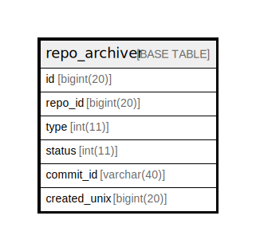

# repo_archiver

## 概要

<details>
<summary><strong>テーブル定義</strong></summary>

```sql
CREATE TABLE `repo_archiver` (
  `id` bigint(20) NOT NULL AUTO_INCREMENT,
  `repo_id` bigint(20) DEFAULT NULL,
  `type` int(11) DEFAULT NULL,
  `status` int(11) DEFAULT NULL,
  `commit_id` varchar(40) DEFAULT NULL,
  `created_unix` bigint(20) NOT NULL,
  PRIMARY KEY (`id`),
  UNIQUE KEY `UQE_repo_archiver_s` (`repo_id`,`type`,`commit_id`),
  KEY `IDX_repo_archiver_repo_id` (`repo_id`),
  KEY `IDX_repo_archiver_created_unix` (`created_unix`)
) ENGINE=InnoDB DEFAULT CHARSET=utf8mb4 ROW_FORMAT=DYNAMIC
```

</details>

## カラム一覧

| 名前           | タイプ         | デフォルト値       | NULL許可   | Extra Definition | 子テーブル      | 親テーブル      | コメント     |
| ------------ | ----------- | ------------ | -------- | ---------------- | ---------- | ---------- | -------- |
| id           | bigint(20)  |              | false    | auto_increment   |            |            |          |
| repo_id      | bigint(20)  | NULL         | true     |                  |            |            |          |
| type         | int(11)     | NULL         | true     |                  |            |            |          |
| status       | int(11)     | NULL         | true     |                  |            |            |          |
| commit_id    | varchar(40) | NULL         | true     |                  |            |            |          |
| created_unix | bigint(20)  |              | false    |                  |            |            |          |

## 制約一覧

| 名前                  | タイプ         | 定義                                                        |
| ------------------- | ----------- | --------------------------------------------------------- |
| PRIMARY             | PRIMARY KEY | PRIMARY KEY (id)                                          |
| UQE_repo_archiver_s | UNIQUE      | UNIQUE KEY UQE_repo_archiver_s (repo_id, type, commit_id) |

## INDEX一覧

| 名前                             | 定義                                                                    |
| ------------------------------ | --------------------------------------------------------------------- |
| IDX_repo_archiver_created_unix | KEY IDX_repo_archiver_created_unix (created_unix) USING BTREE         |
| IDX_repo_archiver_repo_id      | KEY IDX_repo_archiver_repo_id (repo_id) USING BTREE                   |
| PRIMARY                        | PRIMARY KEY (id) USING BTREE                                          |
| UQE_repo_archiver_s            | UNIQUE KEY UQE_repo_archiver_s (repo_id, type, commit_id) USING BTREE |

## ER図



---

> Generated by [tbls](https://github.com/k1LoW/tbls)
