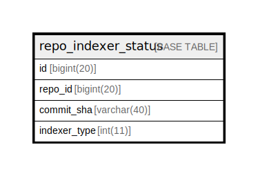

# repo_indexer_status

## 概要

<details>
<summary><strong>テーブル定義</strong></summary>

```sql
CREATE TABLE `repo_indexer_status` (
  `id` bigint(20) NOT NULL AUTO_INCREMENT,
  `repo_id` bigint(20) DEFAULT NULL,
  `commit_sha` varchar(40) DEFAULT NULL,
  `indexer_type` int(11) NOT NULL DEFAULT 0,
  PRIMARY KEY (`id`),
  KEY `IDX_repo_indexer_status_s` (`repo_id`,`indexer_type`)
) ENGINE=InnoDB DEFAULT CHARSET=utf8mb4 ROW_FORMAT=DYNAMIC
```

</details>

## カラム一覧

| 名前           | タイプ         | デフォルト値       | NULL許可   | Extra Definition | 子テーブル      | 親テーブル      | コメント     |
| ------------ | ----------- | ------------ | -------- | ---------------- | ---------- | ---------- | -------- |
| id           | bigint(20)  |              | false    | auto_increment   |            |            |          |
| repo_id      | bigint(20)  | NULL         | true     |                  |            |            |          |
| commit_sha   | varchar(40) | NULL         | true     |                  |            |            |          |
| indexer_type | int(11)     | 0            | false    |                  |            |            |          |

## 制約一覧

| 名前      | タイプ         | 定義               |
| ------- | ----------- | ---------------- |
| PRIMARY | PRIMARY KEY | PRIMARY KEY (id) |

## INDEX一覧

| 名前                        | 定義                                                                |
| ------------------------- | ----------------------------------------------------------------- |
| IDX_repo_indexer_status_s | KEY IDX_repo_indexer_status_s (repo_id, indexer_type) USING BTREE |
| PRIMARY                   | PRIMARY KEY (id) USING BTREE                                      |

## ER図



---

> Generated by [tbls](https://github.com/k1LoW/tbls)
