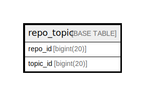

# repo_topic

## 概要

<details>
<summary><strong>テーブル定義</strong></summary>

```sql
CREATE TABLE `repo_topic` (
  `repo_id` bigint(20) NOT NULL,
  `topic_id` bigint(20) NOT NULL,
  PRIMARY KEY (`repo_id`,`topic_id`)
) ENGINE=InnoDB DEFAULT CHARSET=utf8mb4 ROW_FORMAT=DYNAMIC
```

</details>

## カラム一覧

| 名前       | タイプ        | デフォルト値       | NULL許可   | 子テーブル      | 親テーブル      | コメント     |
| -------- | ---------- | ------------ | -------- | ---------- | ---------- | -------- |
| repo_id  | bigint(20) |              | false    |            |            |          |
| topic_id | bigint(20) |              | false    |            |            |          |

## 制約一覧

| 名前      | タイプ         | 定義                              |
| ------- | ----------- | ------------------------------- |
| PRIMARY | PRIMARY KEY | PRIMARY KEY (repo_id, topic_id) |

## INDEX一覧

| 名前      | 定義                                          |
| ------- | ------------------------------------------- |
| PRIMARY | PRIMARY KEY (repo_id, topic_id) USING BTREE |

## ER図



---

> Generated by [tbls](https://github.com/k1LoW/tbls)
