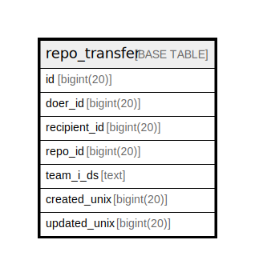

# repo_transfer

## 概要

<details>
<summary><strong>テーブル定義</strong></summary>

```sql
CREATE TABLE `repo_transfer` (
  `id` bigint(20) NOT NULL AUTO_INCREMENT,
  `doer_id` bigint(20) DEFAULT NULL,
  `recipient_id` bigint(20) DEFAULT NULL,
  `repo_id` bigint(20) DEFAULT NULL,
  `team_i_ds` text DEFAULT NULL,
  `created_unix` bigint(20) NOT NULL,
  `updated_unix` bigint(20) NOT NULL,
  PRIMARY KEY (`id`),
  KEY `IDX_repo_transfer_created_unix` (`created_unix`),
  KEY `IDX_repo_transfer_updated_unix` (`updated_unix`)
) ENGINE=InnoDB DEFAULT CHARSET=utf8mb4 ROW_FORMAT=DYNAMIC
```

</details>

## カラム一覧

| 名前           | タイプ        | デフォルト値       | NULL許可   | Extra Definition | 子テーブル      | 親テーブル      | コメント     |
| ------------ | ---------- | ------------ | -------- | ---------------- | ---------- | ---------- | -------- |
| id           | bigint(20) |              | false    | auto_increment   |            |            |          |
| doer_id      | bigint(20) | NULL         | true     |                  |            |            |          |
| recipient_id | bigint(20) | NULL         | true     |                  |            |            |          |
| repo_id      | bigint(20) | NULL         | true     |                  |            |            |          |
| team_i_ds    | text       | NULL         | true     |                  |            |            |          |
| created_unix | bigint(20) |              | false    |                  |            |            |          |
| updated_unix | bigint(20) |              | false    |                  |            |            |          |

## 制約一覧

| 名前      | タイプ         | 定義               |
| ------- | ----------- | ---------------- |
| PRIMARY | PRIMARY KEY | PRIMARY KEY (id) |

## INDEX一覧

| 名前                             | 定義                                                            |
| ------------------------------ | ------------------------------------------------------------- |
| IDX_repo_transfer_created_unix | KEY IDX_repo_transfer_created_unix (created_unix) USING BTREE |
| IDX_repo_transfer_updated_unix | KEY IDX_repo_transfer_updated_unix (updated_unix) USING BTREE |
| PRIMARY                        | PRIMARY KEY (id) USING BTREE                                  |

## ER図



---

> Generated by [tbls](https://github.com/k1LoW/tbls)
