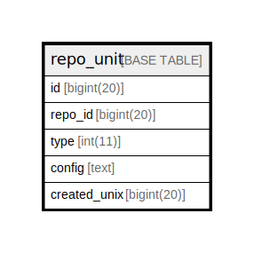

# repo_unit

## 概要

<details>
<summary><strong>テーブル定義</strong></summary>

```sql
CREATE TABLE `repo_unit` (
  `id` bigint(20) NOT NULL AUTO_INCREMENT,
  `repo_id` bigint(20) DEFAULT NULL,
  `type` int(11) DEFAULT NULL,
  `config` text DEFAULT NULL,
  `created_unix` bigint(20) DEFAULT NULL,
  PRIMARY KEY (`id`),
  KEY `IDX_repo_unit_s` (`repo_id`,`type`),
  KEY `IDX_repo_unit_created_unix` (`created_unix`)
) ENGINE=InnoDB DEFAULT CHARSET=utf8mb4 ROW_FORMAT=DYNAMIC
```

</details>

## カラム一覧

| 名前           | タイプ        | デフォルト値       | NULL許可   | Extra Definition | 子テーブル      | 親テーブル      | コメント     |
| ------------ | ---------- | ------------ | -------- | ---------------- | ---------- | ---------- | -------- |
| id           | bigint(20) |              | false    | auto_increment   |            |            |          |
| repo_id      | bigint(20) | NULL         | true     |                  |            |            |          |
| type         | int(11)    | NULL         | true     |                  |            |            |          |
| config       | text       | NULL         | true     |                  |            |            |          |
| created_unix | bigint(20) | NULL         | true     |                  |            |            |          |

## 制約一覧

| 名前      | タイプ         | 定義               |
| ------- | ----------- | ---------------- |
| PRIMARY | PRIMARY KEY | PRIMARY KEY (id) |

## INDEX一覧

| 名前                         | 定義                                                        |
| -------------------------- | --------------------------------------------------------- |
| IDX_repo_unit_created_unix | KEY IDX_repo_unit_created_unix (created_unix) USING BTREE |
| IDX_repo_unit_s            | KEY IDX_repo_unit_s (repo_id, type) USING BTREE           |
| PRIMARY                    | PRIMARY KEY (id) USING BTREE                              |

## ER図



---

> Generated by [tbls](https://github.com/k1LoW/tbls)
