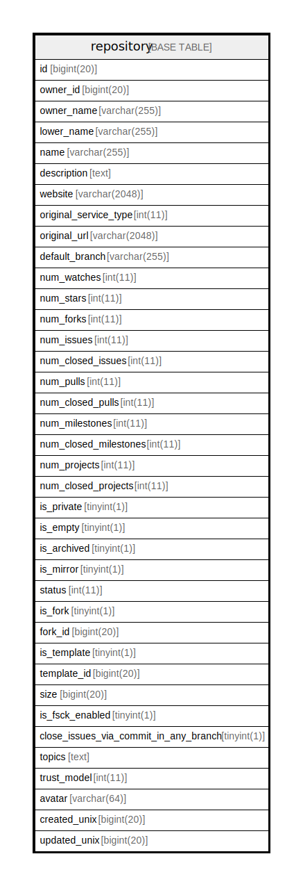

# repository

## 概要

<details>
<summary><strong>テーブル定義</strong></summary>

```sql
CREATE TABLE `repository` (
  `id` bigint(20) NOT NULL AUTO_INCREMENT,
  `owner_id` bigint(20) DEFAULT NULL,
  `owner_name` varchar(255) DEFAULT NULL,
  `lower_name` varchar(255) NOT NULL,
  `name` varchar(255) NOT NULL,
  `description` text DEFAULT NULL,
  `website` varchar(2048) DEFAULT NULL,
  `original_service_type` int(11) DEFAULT NULL,
  `original_url` varchar(2048) DEFAULT NULL,
  `default_branch` varchar(255) DEFAULT NULL,
  `num_watches` int(11) DEFAULT NULL,
  `num_stars` int(11) DEFAULT NULL,
  `num_forks` int(11) DEFAULT NULL,
  `num_issues` int(11) DEFAULT NULL,
  `num_closed_issues` int(11) DEFAULT NULL,
  `num_pulls` int(11) DEFAULT NULL,
  `num_closed_pulls` int(11) DEFAULT NULL,
  `num_milestones` int(11) NOT NULL DEFAULT 0,
  `num_closed_milestones` int(11) NOT NULL DEFAULT 0,
  `num_projects` int(11) NOT NULL DEFAULT 0,
  `num_closed_projects` int(11) NOT NULL DEFAULT 0,
  `is_private` tinyint(1) DEFAULT NULL,
  `is_empty` tinyint(1) DEFAULT NULL,
  `is_archived` tinyint(1) DEFAULT NULL,
  `is_mirror` tinyint(1) DEFAULT NULL,
  `status` int(11) NOT NULL DEFAULT 0,
  `is_fork` tinyint(1) NOT NULL DEFAULT 0,
  `fork_id` bigint(20) DEFAULT NULL,
  `is_template` tinyint(1) NOT NULL DEFAULT 0,
  `template_id` bigint(20) DEFAULT NULL,
  `size` bigint(20) NOT NULL DEFAULT 0,
  `is_fsck_enabled` tinyint(1) NOT NULL DEFAULT 1,
  `close_issues_via_commit_in_any_branch` tinyint(1) NOT NULL DEFAULT 0,
  `topics` text DEFAULT NULL,
  `trust_model` int(11) DEFAULT NULL,
  `avatar` varchar(64) DEFAULT NULL,
  `created_unix` bigint(20) DEFAULT NULL,
  `updated_unix` bigint(20) DEFAULT NULL,
  PRIMARY KEY (`id`),
  UNIQUE KEY `UQE_repository_s` (`owner_id`,`lower_name`),
  KEY `IDX_repository_original_service_type` (`original_service_type`),
  KEY `IDX_repository_is_fork` (`is_fork`),
  KEY `IDX_repository_updated_unix` (`updated_unix`),
  KEY `IDX_repository_name` (`name`),
  KEY `IDX_repository_is_mirror` (`is_mirror`),
  KEY `IDX_repository_fork_id` (`fork_id`),
  KEY `IDX_repository_lower_name` (`lower_name`),
  KEY `IDX_repository_is_empty` (`is_empty`),
  KEY `IDX_repository_is_archived` (`is_archived`),
  KEY `IDX_repository_is_template` (`is_template`),
  KEY `IDX_repository_created_unix` (`created_unix`),
  KEY `IDX_repository_owner_id` (`owner_id`),
  KEY `IDX_repository_is_private` (`is_private`),
  KEY `IDX_repository_template_id` (`template_id`)
) ENGINE=InnoDB DEFAULT CHARSET=utf8mb4 ROW_FORMAT=DYNAMIC
```

</details>

## カラム一覧

| 名前                                    | タイプ           | デフォルト値       | NULL許可   | Extra Definition | 子テーブル      | 親テーブル      | コメント     |
| ------------------------------------- | ------------- | ------------ | -------- | ---------------- | ---------- | ---------- | -------- |
| id                                    | bigint(20)    |              | false    | auto_increment   |            |            |          |
| owner_id                              | bigint(20)    | NULL         | true     |                  |            |            |          |
| owner_name                            | varchar(255)  | NULL         | true     |                  |            |            |          |
| lower_name                            | varchar(255)  |              | false    |                  |            |            |          |
| name                                  | varchar(255)  |              | false    |                  |            |            |          |
| description                           | text          | NULL         | true     |                  |            |            |          |
| website                               | varchar(2048) | NULL         | true     |                  |            |            |          |
| original_service_type                 | int(11)       | NULL         | true     |                  |            |            |          |
| original_url                          | varchar(2048) | NULL         | true     |                  |            |            |          |
| default_branch                        | varchar(255)  | NULL         | true     |                  |            |            |          |
| num_watches                           | int(11)       | NULL         | true     |                  |            |            |          |
| num_stars                             | int(11)       | NULL         | true     |                  |            |            |          |
| num_forks                             | int(11)       | NULL         | true     |                  |            |            |          |
| num_issues                            | int(11)       | NULL         | true     |                  |            |            |          |
| num_closed_issues                     | int(11)       | NULL         | true     |                  |            |            |          |
| num_pulls                             | int(11)       | NULL         | true     |                  |            |            |          |
| num_closed_pulls                      | int(11)       | NULL         | true     |                  |            |            |          |
| num_milestones                        | int(11)       | 0            | false    |                  |            |            |          |
| num_closed_milestones                 | int(11)       | 0            | false    |                  |            |            |          |
| num_projects                          | int(11)       | 0            | false    |                  |            |            |          |
| num_closed_projects                   | int(11)       | 0            | false    |                  |            |            |          |
| is_private                            | tinyint(1)    | NULL         | true     |                  |            |            |          |
| is_empty                              | tinyint(1)    | NULL         | true     |                  |            |            |          |
| is_archived                           | tinyint(1)    | NULL         | true     |                  |            |            |          |
| is_mirror                             | tinyint(1)    | NULL         | true     |                  |            |            |          |
| status                                | int(11)       | 0            | false    |                  |            |            |          |
| is_fork                               | tinyint(1)    | 0            | false    |                  |            |            |          |
| fork_id                               | bigint(20)    | NULL         | true     |                  |            |            |          |
| is_template                           | tinyint(1)    | 0            | false    |                  |            |            |          |
| template_id                           | bigint(20)    | NULL         | true     |                  |            |            |          |
| size                                  | bigint(20)    | 0            | false    |                  |            |            |          |
| is_fsck_enabled                       | tinyint(1)    | 1            | false    |                  |            |            |          |
| close_issues_via_commit_in_any_branch | tinyint(1)    | 0            | false    |                  |            |            |          |
| topics                                | text          | NULL         | true     |                  |            |            |          |
| trust_model                           | int(11)       | NULL         | true     |                  |            |            |          |
| avatar                                | varchar(64)   | NULL         | true     |                  |            |            |          |
| created_unix                          | bigint(20)    | NULL         | true     |                  |            |            |          |
| updated_unix                          | bigint(20)    | NULL         | true     |                  |            |            |          |

## 制約一覧

| 名前               | タイプ         | 定義                                                 |
| ---------------- | ----------- | -------------------------------------------------- |
| PRIMARY          | PRIMARY KEY | PRIMARY KEY (id)                                   |
| UQE_repository_s | UNIQUE      | UNIQUE KEY UQE_repository_s (owner_id, lower_name) |

## INDEX一覧

| 名前                                   | 定義                                                                           |
| ------------------------------------ | ---------------------------------------------------------------------------- |
| IDX_repository_created_unix          | KEY IDX_repository_created_unix (created_unix) USING BTREE                   |
| IDX_repository_fork_id               | KEY IDX_repository_fork_id (fork_id) USING BTREE                             |
| IDX_repository_is_archived           | KEY IDX_repository_is_archived (is_archived) USING BTREE                     |
| IDX_repository_is_empty              | KEY IDX_repository_is_empty (is_empty) USING BTREE                           |
| IDX_repository_is_fork               | KEY IDX_repository_is_fork (is_fork) USING BTREE                             |
| IDX_repository_is_mirror             | KEY IDX_repository_is_mirror (is_mirror) USING BTREE                         |
| IDX_repository_is_private            | KEY IDX_repository_is_private (is_private) USING BTREE                       |
| IDX_repository_is_template           | KEY IDX_repository_is_template (is_template) USING BTREE                     |
| IDX_repository_lower_name            | KEY IDX_repository_lower_name (lower_name) USING BTREE                       |
| IDX_repository_name                  | KEY IDX_repository_name (name) USING BTREE                                   |
| IDX_repository_original_service_type | KEY IDX_repository_original_service_type (original_service_type) USING BTREE |
| IDX_repository_owner_id              | KEY IDX_repository_owner_id (owner_id) USING BTREE                           |
| IDX_repository_template_id           | KEY IDX_repository_template_id (template_id) USING BTREE                     |
| IDX_repository_updated_unix          | KEY IDX_repository_updated_unix (updated_unix) USING BTREE                   |
| PRIMARY                              | PRIMARY KEY (id) USING BTREE                                                 |
| UQE_repository_s                     | UNIQUE KEY UQE_repository_s (owner_id, lower_name) USING BTREE               |

## ER図



---

> Generated by [tbls](https://github.com/k1LoW/tbls)
