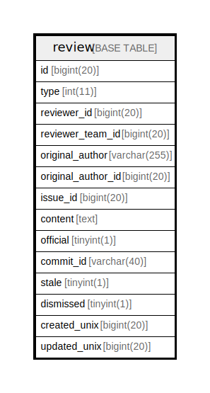

# review

## 概要

<details>
<summary><strong>テーブル定義</strong></summary>

```sql
CREATE TABLE `review` (
  `id` bigint(20) NOT NULL AUTO_INCREMENT,
  `type` int(11) DEFAULT NULL,
  `reviewer_id` bigint(20) DEFAULT NULL,
  `reviewer_team_id` bigint(20) NOT NULL DEFAULT 0,
  `original_author` varchar(255) DEFAULT NULL,
  `original_author_id` bigint(20) DEFAULT NULL,
  `issue_id` bigint(20) DEFAULT NULL,
  `content` text DEFAULT NULL,
  `official` tinyint(1) NOT NULL DEFAULT 0,
  `commit_id` varchar(40) DEFAULT NULL,
  `stale` tinyint(1) NOT NULL DEFAULT 0,
  `dismissed` tinyint(1) NOT NULL DEFAULT 0,
  `created_unix` bigint(20) DEFAULT NULL,
  `updated_unix` bigint(20) DEFAULT NULL,
  PRIMARY KEY (`id`),
  KEY `IDX_review_reviewer_id` (`reviewer_id`),
  KEY `IDX_review_issue_id` (`issue_id`),
  KEY `IDX_review_created_unix` (`created_unix`),
  KEY `IDX_review_updated_unix` (`updated_unix`)
) ENGINE=InnoDB DEFAULT CHARSET=utf8mb4 ROW_FORMAT=DYNAMIC
```

</details>

## カラム一覧

| 名前                 | タイプ          | デフォルト値       | NULL許可   | Extra Definition | 子テーブル      | 親テーブル      | コメント     |
| ------------------ | ------------ | ------------ | -------- | ---------------- | ---------- | ---------- | -------- |
| id                 | bigint(20)   |              | false    | auto_increment   |            |            |          |
| type               | int(11)      | NULL         | true     |                  |            |            |          |
| reviewer_id        | bigint(20)   | NULL         | true     |                  |            |            |          |
| reviewer_team_id   | bigint(20)   | 0            | false    |                  |            |            |          |
| original_author    | varchar(255) | NULL         | true     |                  |            |            |          |
| original_author_id | bigint(20)   | NULL         | true     |                  |            |            |          |
| issue_id           | bigint(20)   | NULL         | true     |                  |            |            |          |
| content            | text         | NULL         | true     |                  |            |            |          |
| official           | tinyint(1)   | 0            | false    |                  |            |            |          |
| commit_id          | varchar(40)  | NULL         | true     |                  |            |            |          |
| stale              | tinyint(1)   | 0            | false    |                  |            |            |          |
| dismissed          | tinyint(1)   | 0            | false    |                  |            |            |          |
| created_unix       | bigint(20)   | NULL         | true     |                  |            |            |          |
| updated_unix       | bigint(20)   | NULL         | true     |                  |            |            |          |

## 制約一覧

| 名前      | タイプ         | 定義               |
| ------- | ----------- | ---------------- |
| PRIMARY | PRIMARY KEY | PRIMARY KEY (id) |

## INDEX一覧

| 名前                      | 定義                                                     |
| ----------------------- | ------------------------------------------------------ |
| IDX_review_created_unix | KEY IDX_review_created_unix (created_unix) USING BTREE |
| IDX_review_issue_id     | KEY IDX_review_issue_id (issue_id) USING BTREE         |
| IDX_review_reviewer_id  | KEY IDX_review_reviewer_id (reviewer_id) USING BTREE   |
| IDX_review_updated_unix | KEY IDX_review_updated_unix (updated_unix) USING BTREE |
| PRIMARY                 | PRIMARY KEY (id) USING BTREE                           |

## ER図



---

> Generated by [tbls](https://github.com/k1LoW/tbls)
