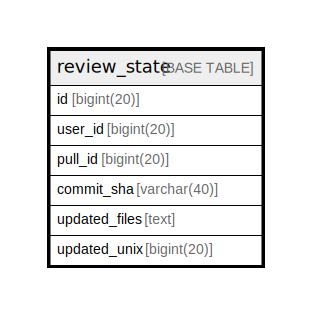

# review_state

## 概要

<details>
<summary><strong>テーブル定義</strong></summary>

```sql
CREATE TABLE `review_state` (
  `id` bigint(20) NOT NULL AUTO_INCREMENT,
  `user_id` bigint(20) NOT NULL,
  `pull_id` bigint(20) NOT NULL DEFAULT 0,
  `commit_sha` varchar(40) NOT NULL,
  `updated_files` text NOT NULL,
  `updated_unix` bigint(20) DEFAULT NULL,
  PRIMARY KEY (`id`),
  UNIQUE KEY `UQE_review_state_pull_commit_user` (`user_id`,`pull_id`,`commit_sha`),
  KEY `IDX_review_state_pull_id` (`pull_id`)
) ENGINE=InnoDB DEFAULT CHARSET=utf8mb4 ROW_FORMAT=DYNAMIC
```

</details>

## カラム一覧

| 名前            | タイプ         | デフォルト値       | NULL許可   | Extra Definition | 子テーブル      | 親テーブル      | コメント     |
| ------------- | ----------- | ------------ | -------- | ---------------- | ---------- | ---------- | -------- |
| id            | bigint(20)  |              | false    | auto_increment   |            |            |          |
| user_id       | bigint(20)  |              | false    |                  |            |            |          |
| pull_id       | bigint(20)  | 0            | false    |                  |            |            |          |
| commit_sha    | varchar(40) |              | false    |                  |            |            |          |
| updated_files | text        |              | false    |                  |            |            |          |
| updated_unix  | bigint(20)  | NULL         | true     |                  |            |            |          |

## 制約一覧

| 名前                                | タイプ         | 定義                                                                          |
| --------------------------------- | ----------- | --------------------------------------------------------------------------- |
| PRIMARY                           | PRIMARY KEY | PRIMARY KEY (id)                                                            |
| UQE_review_state_pull_commit_user | UNIQUE      | UNIQUE KEY UQE_review_state_pull_commit_user (user_id, pull_id, commit_sha) |

## INDEX一覧

| 名前                                | 定義                                                                                      |
| --------------------------------- | --------------------------------------------------------------------------------------- |
| IDX_review_state_pull_id          | KEY IDX_review_state_pull_id (pull_id) USING BTREE                                      |
| PRIMARY                           | PRIMARY KEY (id) USING BTREE                                                            |
| UQE_review_state_pull_commit_user | UNIQUE KEY UQE_review_state_pull_commit_user (user_id, pull_id, commit_sha) USING BTREE |

## ER図



---

> Generated by [tbls](https://github.com/k1LoW/tbls)
