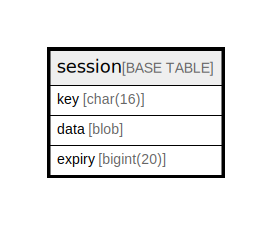

# session

## 概要

<details>
<summary><strong>テーブル定義</strong></summary>

```sql
CREATE TABLE `session` (
  `key` char(16) NOT NULL,
  `data` blob DEFAULT NULL,
  `expiry` bigint(20) DEFAULT NULL,
  PRIMARY KEY (`key`)
) ENGINE=InnoDB DEFAULT CHARSET=utf8mb4 ROW_FORMAT=DYNAMIC
```

</details>

## カラム一覧

| 名前     | タイプ        | デフォルト値       | NULL許可   | 子テーブル      | 親テーブル      | コメント     |
| ------ | ---------- | ------------ | -------- | ---------- | ---------- | -------- |
| key    | char(16)   |              | false    |            |            |          |
| data   | blob       | NULL         | true     |            |            |          |
| expiry | bigint(20) | NULL         | true     |            |            |          |

## 制約一覧

| 名前      | タイプ         | 定義                |
| ------- | ----------- | ----------------- |
| PRIMARY | PRIMARY KEY | PRIMARY KEY (key) |

## INDEX一覧

| 名前      | 定義                            |
| ------- | ----------------------------- |
| PRIMARY | PRIMARY KEY (key) USING BTREE |

## ER図



---

> Generated by [tbls](https://github.com/k1LoW/tbls)
