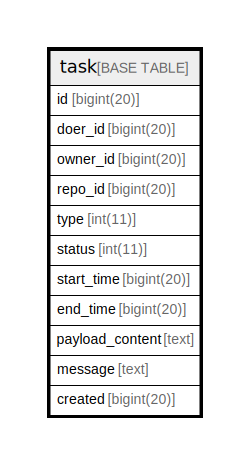

# task

## 概要

<details>
<summary><strong>テーブル定義</strong></summary>

```sql
CREATE TABLE `task` (
  `id` bigint(20) NOT NULL AUTO_INCREMENT,
  `doer_id` bigint(20) DEFAULT NULL,
  `owner_id` bigint(20) DEFAULT NULL,
  `repo_id` bigint(20) DEFAULT NULL,
  `type` int(11) DEFAULT NULL,
  `status` int(11) DEFAULT NULL,
  `start_time` bigint(20) DEFAULT NULL,
  `end_time` bigint(20) DEFAULT NULL,
  `payload_content` text DEFAULT NULL,
  `message` text DEFAULT NULL,
  `created` bigint(20) DEFAULT NULL,
  PRIMARY KEY (`id`),
  KEY `IDX_task_doer_id` (`doer_id`),
  KEY `IDX_task_owner_id` (`owner_id`),
  KEY `IDX_task_repo_id` (`repo_id`),
  KEY `IDX_task_status` (`status`)
) ENGINE=InnoDB DEFAULT CHARSET=utf8mb4 ROW_FORMAT=DYNAMIC
```

</details>

## カラム一覧

| 名前              | タイプ        | デフォルト値       | NULL許可   | Extra Definition | 子テーブル      | 親テーブル      | コメント     |
| --------------- | ---------- | ------------ | -------- | ---------------- | ---------- | ---------- | -------- |
| id              | bigint(20) |              | false    | auto_increment   |            |            |          |
| doer_id         | bigint(20) | NULL         | true     |                  |            |            |          |
| owner_id        | bigint(20) | NULL         | true     |                  |            |            |          |
| repo_id         | bigint(20) | NULL         | true     |                  |            |            |          |
| type            | int(11)    | NULL         | true     |                  |            |            |          |
| status          | int(11)    | NULL         | true     |                  |            |            |          |
| start_time      | bigint(20) | NULL         | true     |                  |            |            |          |
| end_time        | bigint(20) | NULL         | true     |                  |            |            |          |
| payload_content | text       | NULL         | true     |                  |            |            |          |
| message         | text       | NULL         | true     |                  |            |            |          |
| created         | bigint(20) | NULL         | true     |                  |            |            |          |

## 制約一覧

| 名前      | タイプ         | 定義               |
| ------- | ----------- | ---------------- |
| PRIMARY | PRIMARY KEY | PRIMARY KEY (id) |

## INDEX一覧

| 名前                | 定義                                           |
| ----------------- | -------------------------------------------- |
| IDX_task_doer_id  | KEY IDX_task_doer_id (doer_id) USING BTREE   |
| IDX_task_owner_id | KEY IDX_task_owner_id (owner_id) USING BTREE |
| IDX_task_repo_id  | KEY IDX_task_repo_id (repo_id) USING BTREE   |
| IDX_task_status   | KEY IDX_task_status (status) USING BTREE     |
| PRIMARY           | PRIMARY KEY (id) USING BTREE                 |

## ER図



---

> Generated by [tbls](https://github.com/k1LoW/tbls)
