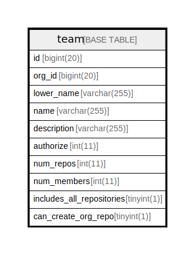

# team

## 概要

<details>
<summary><strong>テーブル定義</strong></summary>

```sql
CREATE TABLE `team` (
  `id` bigint(20) NOT NULL AUTO_INCREMENT,
  `org_id` bigint(20) DEFAULT NULL,
  `lower_name` varchar(255) DEFAULT NULL,
  `name` varchar(255) DEFAULT NULL,
  `description` varchar(255) DEFAULT NULL,
  `authorize` int(11) DEFAULT NULL,
  `num_repos` int(11) DEFAULT NULL,
  `num_members` int(11) DEFAULT NULL,
  `includes_all_repositories` tinyint(1) NOT NULL DEFAULT 0,
  `can_create_org_repo` tinyint(1) NOT NULL DEFAULT 0,
  PRIMARY KEY (`id`),
  KEY `IDX_team_org_id` (`org_id`)
) ENGINE=InnoDB DEFAULT CHARSET=utf8mb4 ROW_FORMAT=DYNAMIC
```

</details>

## カラム一覧

| 名前                        | タイプ          | デフォルト値       | NULL許可   | Extra Definition | 子テーブル      | 親テーブル      | コメント     |
| ------------------------- | ------------ | ------------ | -------- | ---------------- | ---------- | ---------- | -------- |
| id                        | bigint(20)   |              | false    | auto_increment   |            |            |          |
| org_id                    | bigint(20)   | NULL         | true     |                  |            |            |          |
| lower_name                | varchar(255) | NULL         | true     |                  |            |            |          |
| name                      | varchar(255) | NULL         | true     |                  |            |            |          |
| description               | varchar(255) | NULL         | true     |                  |            |            |          |
| authorize                 | int(11)      | NULL         | true     |                  |            |            |          |
| num_repos                 | int(11)      | NULL         | true     |                  |            |            |          |
| num_members               | int(11)      | NULL         | true     |                  |            |            |          |
| includes_all_repositories | tinyint(1)   | 0            | false    |                  |            |            |          |
| can_create_org_repo       | tinyint(1)   | 0            | false    |                  |            |            |          |

## 制約一覧

| 名前      | タイプ         | 定義               |
| ------- | ----------- | ---------------- |
| PRIMARY | PRIMARY KEY | PRIMARY KEY (id) |

## INDEX一覧

| 名前              | 定義                                       |
| --------------- | ---------------------------------------- |
| IDX_team_org_id | KEY IDX_team_org_id (org_id) USING BTREE |
| PRIMARY         | PRIMARY KEY (id) USING BTREE             |

## ER図



---

> Generated by [tbls](https://github.com/k1LoW/tbls)
