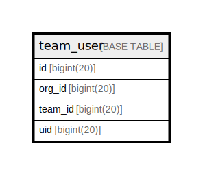

# team_user

## 概要

<details>
<summary><strong>テーブル定義</strong></summary>

```sql
CREATE TABLE `team_user` (
  `id` bigint(20) NOT NULL AUTO_INCREMENT,
  `org_id` bigint(20) DEFAULT NULL,
  `team_id` bigint(20) DEFAULT NULL,
  `uid` bigint(20) DEFAULT NULL,
  PRIMARY KEY (`id`),
  UNIQUE KEY `UQE_team_user_s` (`team_id`,`uid`),
  KEY `IDX_team_user_org_id` (`org_id`)
) ENGINE=InnoDB DEFAULT CHARSET=utf8mb4 ROW_FORMAT=DYNAMIC
```

</details>

## カラム一覧

| 名前      | タイプ        | デフォルト値       | NULL許可   | Extra Definition | 子テーブル      | 親テーブル      | コメント     |
| ------- | ---------- | ------------ | -------- | ---------------- | ---------- | ---------- | -------- |
| id      | bigint(20) |              | false    | auto_increment   |            |            |          |
| org_id  | bigint(20) | NULL         | true     |                  |            |            |          |
| team_id | bigint(20) | NULL         | true     |                  |            |            |          |
| uid     | bigint(20) | NULL         | true     |                  |            |            |          |

## 制約一覧

| 名前              | タイプ         | 定義                                        |
| --------------- | ----------- | ----------------------------------------- |
| PRIMARY         | PRIMARY KEY | PRIMARY KEY (id)                          |
| UQE_team_user_s | UNIQUE      | UNIQUE KEY UQE_team_user_s (team_id, uid) |

## INDEX一覧

| 名前                   | 定義                                                    |
| -------------------- | ----------------------------------------------------- |
| IDX_team_user_org_id | KEY IDX_team_user_org_id (org_id) USING BTREE         |
| PRIMARY              | PRIMARY KEY (id) USING BTREE                          |
| UQE_team_user_s      | UNIQUE KEY UQE_team_user_s (team_id, uid) USING BTREE |

## ER図



---

> Generated by [tbls](https://github.com/k1LoW/tbls)
