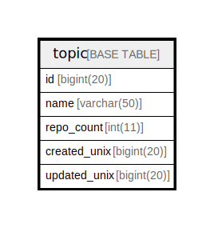

# topic

## 概要

<details>
<summary><strong>テーブル定義</strong></summary>

```sql
CREATE TABLE `topic` (
  `id` bigint(20) NOT NULL AUTO_INCREMENT,
  `name` varchar(50) DEFAULT NULL,
  `repo_count` int(11) DEFAULT NULL,
  `created_unix` bigint(20) DEFAULT NULL,
  `updated_unix` bigint(20) DEFAULT NULL,
  PRIMARY KEY (`id`),
  UNIQUE KEY `UQE_topic_name` (`name`),
  KEY `IDX_topic_updated_unix` (`updated_unix`),
  KEY `IDX_topic_created_unix` (`created_unix`)
) ENGINE=InnoDB DEFAULT CHARSET=utf8mb4 ROW_FORMAT=DYNAMIC
```

</details>

## カラム一覧

| 名前           | タイプ         | デフォルト値       | NULL許可   | Extra Definition | 子テーブル      | 親テーブル      | コメント     |
| ------------ | ----------- | ------------ | -------- | ---------------- | ---------- | ---------- | -------- |
| id           | bigint(20)  |              | false    | auto_increment   |            |            |          |
| name         | varchar(50) | NULL         | true     |                  |            |            |          |
| repo_count   | int(11)     | NULL         | true     |                  |            |            |          |
| created_unix | bigint(20)  | NULL         | true     |                  |            |            |          |
| updated_unix | bigint(20)  | NULL         | true     |                  |            |            |          |

## 制約一覧

| 名前             | タイプ         | 定義                               |
| -------------- | ----------- | -------------------------------- |
| PRIMARY        | PRIMARY KEY | PRIMARY KEY (id)                 |
| UQE_topic_name | UNIQUE      | UNIQUE KEY UQE_topic_name (name) |

## INDEX一覧

| 名前                     | 定義                                                    |
| ---------------------- | ----------------------------------------------------- |
| IDX_topic_created_unix | KEY IDX_topic_created_unix (created_unix) USING BTREE |
| IDX_topic_updated_unix | KEY IDX_topic_updated_unix (updated_unix) USING BTREE |
| PRIMARY                | PRIMARY KEY (id) USING BTREE                          |
| UQE_topic_name         | UNIQUE KEY UQE_topic_name (name) USING BTREE          |

## ER図



---

> Generated by [tbls](https://github.com/k1LoW/tbls)
