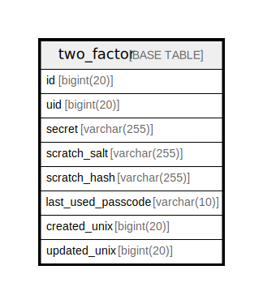

# two_factor

## 概要

<details>
<summary><strong>テーブル定義</strong></summary>

```sql
CREATE TABLE `two_factor` (
  `id` bigint(20) NOT NULL AUTO_INCREMENT,
  `uid` bigint(20) DEFAULT NULL,
  `secret` varchar(255) DEFAULT NULL,
  `scratch_salt` varchar(255) DEFAULT NULL,
  `scratch_hash` varchar(255) DEFAULT NULL,
  `last_used_passcode` varchar(10) DEFAULT NULL,
  `created_unix` bigint(20) DEFAULT NULL,
  `updated_unix` bigint(20) DEFAULT NULL,
  PRIMARY KEY (`id`),
  UNIQUE KEY `UQE_two_factor_uid` (`uid`),
  KEY `IDX_two_factor_created_unix` (`created_unix`),
  KEY `IDX_two_factor_updated_unix` (`updated_unix`)
) ENGINE=InnoDB DEFAULT CHARSET=utf8mb4 ROW_FORMAT=DYNAMIC
```

</details>

## カラム一覧

| 名前                 | タイプ          | デフォルト値       | NULL許可   | Extra Definition | 子テーブル      | 親テーブル      | コメント     |
| ------------------ | ------------ | ------------ | -------- | ---------------- | ---------- | ---------- | -------- |
| id                 | bigint(20)   |              | false    | auto_increment   |            |            |          |
| uid                | bigint(20)   | NULL         | true     |                  |            |            |          |
| secret             | varchar(255) | NULL         | true     |                  |            |            |          |
| scratch_salt       | varchar(255) | NULL         | true     |                  |            |            |          |
| scratch_hash       | varchar(255) | NULL         | true     |                  |            |            |          |
| last_used_passcode | varchar(10)  | NULL         | true     |                  |            |            |          |
| created_unix       | bigint(20)   | NULL         | true     |                  |            |            |          |
| updated_unix       | bigint(20)   | NULL         | true     |                  |            |            |          |

## 制約一覧

| 名前                 | タイプ         | 定義                                  |
| ------------------ | ----------- | ----------------------------------- |
| PRIMARY            | PRIMARY KEY | PRIMARY KEY (id)                    |
| UQE_two_factor_uid | UNIQUE      | UNIQUE KEY UQE_two_factor_uid (uid) |

## INDEX一覧

| 名前                          | 定義                                                         |
| --------------------------- | ---------------------------------------------------------- |
| IDX_two_factor_created_unix | KEY IDX_two_factor_created_unix (created_unix) USING BTREE |
| IDX_two_factor_updated_unix | KEY IDX_two_factor_updated_unix (updated_unix) USING BTREE |
| PRIMARY                     | PRIMARY KEY (id) USING BTREE                               |
| UQE_two_factor_uid          | UNIQUE KEY UQE_two_factor_uid (uid) USING BTREE            |

## ER図



---

> Generated by [tbls](https://github.com/k1LoW/tbls)
