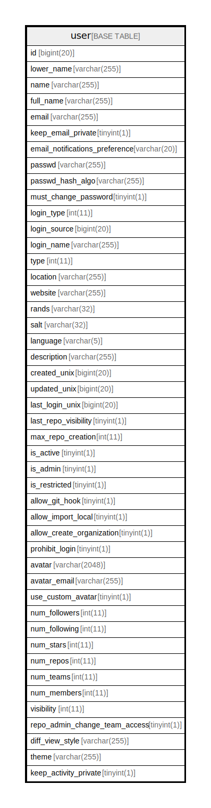

# user

## 概要

<details>
<summary><strong>テーブル定義</strong></summary>

```sql
CREATE TABLE `user` (
  `id` bigint(20) NOT NULL AUTO_INCREMENT,
  `lower_name` varchar(255) NOT NULL,
  `name` varchar(255) NOT NULL,
  `full_name` varchar(255) DEFAULT NULL,
  `email` varchar(255) NOT NULL,
  `keep_email_private` tinyint(1) DEFAULT NULL,
  `email_notifications_preference` varchar(20) NOT NULL DEFAULT 'enabled',
  `passwd` varchar(255) NOT NULL,
  `passwd_hash_algo` varchar(255) NOT NULL DEFAULT 'argon2',
  `must_change_password` tinyint(1) NOT NULL DEFAULT 0,
  `login_type` int(11) DEFAULT NULL,
  `login_source` bigint(20) NOT NULL DEFAULT 0,
  `login_name` varchar(255) DEFAULT NULL,
  `type` int(11) DEFAULT NULL,
  `location` varchar(255) DEFAULT NULL,
  `website` varchar(255) DEFAULT NULL,
  `rands` varchar(32) DEFAULT NULL,
  `salt` varchar(32) DEFAULT NULL,
  `language` varchar(5) DEFAULT NULL,
  `description` varchar(255) DEFAULT NULL,
  `created_unix` bigint(20) DEFAULT NULL,
  `updated_unix` bigint(20) DEFAULT NULL,
  `last_login_unix` bigint(20) DEFAULT NULL,
  `last_repo_visibility` tinyint(1) DEFAULT NULL,
  `max_repo_creation` int(11) NOT NULL DEFAULT -1,
  `is_active` tinyint(1) DEFAULT NULL,
  `is_admin` tinyint(1) DEFAULT NULL,
  `is_restricted` tinyint(1) NOT NULL DEFAULT 0,
  `allow_git_hook` tinyint(1) DEFAULT NULL,
  `allow_import_local` tinyint(1) DEFAULT NULL,
  `allow_create_organization` tinyint(1) DEFAULT 1,
  `prohibit_login` tinyint(1) NOT NULL DEFAULT 0,
  `avatar` varchar(2048) NOT NULL,
  `avatar_email` varchar(255) NOT NULL,
  `use_custom_avatar` tinyint(1) DEFAULT NULL,
  `num_followers` int(11) DEFAULT NULL,
  `num_following` int(11) NOT NULL DEFAULT 0,
  `num_stars` int(11) DEFAULT NULL,
  `num_repos` int(11) DEFAULT NULL,
  `num_teams` int(11) DEFAULT NULL,
  `num_members` int(11) DEFAULT NULL,
  `visibility` int(11) NOT NULL DEFAULT 0,
  `repo_admin_change_team_access` tinyint(1) NOT NULL DEFAULT 0,
  `diff_view_style` varchar(255) NOT NULL DEFAULT '',
  `theme` varchar(255) NOT NULL DEFAULT '',
  `keep_activity_private` tinyint(1) NOT NULL DEFAULT 0,
  PRIMARY KEY (`id`),
  UNIQUE KEY `UQE_user_lower_name` (`lower_name`),
  UNIQUE KEY `UQE_user_name` (`name`),
  KEY `IDX_user_created_unix` (`created_unix`),
  KEY `IDX_user_updated_unix` (`updated_unix`),
  KEY `IDX_user_last_login_unix` (`last_login_unix`),
  KEY `IDX_user_is_active` (`is_active`)
) ENGINE=InnoDB DEFAULT CHARSET=utf8mb4 ROW_FORMAT=DYNAMIC
```

</details>

## カラム一覧

| 名前                             | タイプ           | デフォルト値       | NULL許可   | Extra Definition | 子テーブル      | 親テーブル      | コメント     |
| ------------------------------ | ------------- | ------------ | -------- | ---------------- | ---------- | ---------- | -------- |
| id                             | bigint(20)    |              | false    | auto_increment   |            |            |          |
| lower_name                     | varchar(255)  |              | false    |                  |            |            |          |
| name                           | varchar(255)  |              | false    |                  |            |            |          |
| full_name                      | varchar(255)  | NULL         | true     |                  |            |            |          |
| email                          | varchar(255)  |              | false    |                  |            |            |          |
| keep_email_private             | tinyint(1)    | NULL         | true     |                  |            |            |          |
| email_notifications_preference | varchar(20)   | 'enabled'    | false    |                  |            |            |          |
| passwd                         | varchar(255)  |              | false    |                  |            |            |          |
| passwd_hash_algo               | varchar(255)  | 'argon2'     | false    |                  |            |            |          |
| must_change_password           | tinyint(1)    | 0            | false    |                  |            |            |          |
| login_type                     | int(11)       | NULL         | true     |                  |            |            |          |
| login_source                   | bigint(20)    | 0            | false    |                  |            |            |          |
| login_name                     | varchar(255)  | NULL         | true     |                  |            |            |          |
| type                           | int(11)       | NULL         | true     |                  |            |            |          |
| location                       | varchar(255)  | NULL         | true     |                  |            |            |          |
| website                        | varchar(255)  | NULL         | true     |                  |            |            |          |
| rands                          | varchar(32)   | NULL         | true     |                  |            |            |          |
| salt                           | varchar(32)   | NULL         | true     |                  |            |            |          |
| language                       | varchar(5)    | NULL         | true     |                  |            |            |          |
| description                    | varchar(255)  | NULL         | true     |                  |            |            |          |
| created_unix                   | bigint(20)    | NULL         | true     |                  |            |            |          |
| updated_unix                   | bigint(20)    | NULL         | true     |                  |            |            |          |
| last_login_unix                | bigint(20)    | NULL         | true     |                  |            |            |          |
| last_repo_visibility           | tinyint(1)    | NULL         | true     |                  |            |            |          |
| max_repo_creation              | int(11)       | -1           | false    |                  |            |            |          |
| is_active                      | tinyint(1)    | NULL         | true     |                  |            |            |          |
| is_admin                       | tinyint(1)    | NULL         | true     |                  |            |            |          |
| is_restricted                  | tinyint(1)    | 0            | false    |                  |            |            |          |
| allow_git_hook                 | tinyint(1)    | NULL         | true     |                  |            |            |          |
| allow_import_local             | tinyint(1)    | NULL         | true     |                  |            |            |          |
| allow_create_organization      | tinyint(1)    | 1            | true     |                  |            |            |          |
| prohibit_login                 | tinyint(1)    | 0            | false    |                  |            |            |          |
| avatar                         | varchar(2048) |              | false    |                  |            |            |          |
| avatar_email                   | varchar(255)  |              | false    |                  |            |            |          |
| use_custom_avatar              | tinyint(1)    | NULL         | true     |                  |            |            |          |
| num_followers                  | int(11)       | NULL         | true     |                  |            |            |          |
| num_following                  | int(11)       | 0            | false    |                  |            |            |          |
| num_stars                      | int(11)       | NULL         | true     |                  |            |            |          |
| num_repos                      | int(11)       | NULL         | true     |                  |            |            |          |
| num_teams                      | int(11)       | NULL         | true     |                  |            |            |          |
| num_members                    | int(11)       | NULL         | true     |                  |            |            |          |
| visibility                     | int(11)       | 0            | false    |                  |            |            |          |
| repo_admin_change_team_access  | tinyint(1)    | 0            | false    |                  |            |            |          |
| diff_view_style                | varchar(255)  | ''           | false    |                  |            |            |          |
| theme                          | varchar(255)  | ''           | false    |                  |            |            |          |
| keep_activity_private          | tinyint(1)    | 0            | false    |                  |            |            |          |

## 制約一覧

| 名前                  | タイプ         | 定義                                          |
| ------------------- | ----------- | ------------------------------------------- |
| PRIMARY             | PRIMARY KEY | PRIMARY KEY (id)                            |
| UQE_user_lower_name | UNIQUE      | UNIQUE KEY UQE_user_lower_name (lower_name) |
| UQE_user_name       | UNIQUE      | UNIQUE KEY UQE_user_name (name)             |

## INDEX一覧

| 名前                       | 定義                                                         |
| ------------------------ | ---------------------------------------------------------- |
| IDX_user_created_unix    | KEY IDX_user_created_unix (created_unix) USING BTREE       |
| IDX_user_is_active       | KEY IDX_user_is_active (is_active) USING BTREE             |
| IDX_user_last_login_unix | KEY IDX_user_last_login_unix (last_login_unix) USING BTREE |
| IDX_user_updated_unix    | KEY IDX_user_updated_unix (updated_unix) USING BTREE       |
| PRIMARY                  | PRIMARY KEY (id) USING BTREE                               |
| UQE_user_lower_name      | UNIQUE KEY UQE_user_lower_name (lower_name) USING BTREE    |
| UQE_user_name            | UNIQUE KEY UQE_user_name (name) USING BTREE                |

## ER図



---

> Generated by [tbls](https://github.com/k1LoW/tbls)
