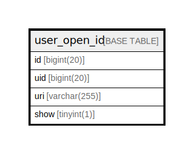

# user_open_id

## 概要

<details>
<summary><strong>テーブル定義</strong></summary>

```sql
CREATE TABLE `user_open_id` (
  `id` bigint(20) NOT NULL AUTO_INCREMENT,
  `uid` bigint(20) NOT NULL,
  `uri` varchar(255) NOT NULL,
  `show` tinyint(1) DEFAULT 0,
  PRIMARY KEY (`id`),
  UNIQUE KEY `UQE_user_open_id_uri` (`uri`),
  KEY `IDX_user_open_id_uid` (`uid`)
) ENGINE=InnoDB DEFAULT CHARSET=utf8mb4 ROW_FORMAT=DYNAMIC
```

</details>

## カラム一覧

| 名前   | タイプ          | デフォルト値       | NULL許可   | Extra Definition | 子テーブル      | 親テーブル      | コメント     |
| ---- | ------------ | ------------ | -------- | ---------------- | ---------- | ---------- | -------- |
| id   | bigint(20)   |              | false    | auto_increment   |            |            |          |
| uid  | bigint(20)   |              | false    |                  |            |            |          |
| uri  | varchar(255) |              | false    |                  |            |            |          |
| show | tinyint(1)   | 0            | true     |                  |            |            |          |

## 制約一覧

| 名前                   | タイプ         | 定義                                    |
| -------------------- | ----------- | ------------------------------------- |
| PRIMARY              | PRIMARY KEY | PRIMARY KEY (id)                      |
| UQE_user_open_id_uri | UNIQUE      | UNIQUE KEY UQE_user_open_id_uri (uri) |

## INDEX一覧

| 名前                   | 定義                                                |
| -------------------- | ------------------------------------------------- |
| IDX_user_open_id_uid | KEY IDX_user_open_id_uid (uid) USING BTREE        |
| PRIMARY              | PRIMARY KEY (id) USING BTREE                      |
| UQE_user_open_id_uri | UNIQUE KEY UQE_user_open_id_uri (uri) USING BTREE |

## ER図



---

> Generated by [tbls](https://github.com/k1LoW/tbls)
