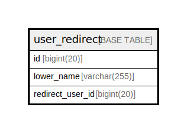

# user_redirect

## 概要

<details>
<summary><strong>テーブル定義</strong></summary>

```sql
CREATE TABLE `user_redirect` (
  `id` bigint(20) NOT NULL AUTO_INCREMENT,
  `lower_name` varchar(255) NOT NULL,
  `redirect_user_id` bigint(20) DEFAULT NULL,
  PRIMARY KEY (`id`),
  UNIQUE KEY `UQE_user_redirect_s` (`lower_name`),
  KEY `IDX_user_redirect_lower_name` (`lower_name`)
) ENGINE=InnoDB DEFAULT CHARSET=utf8mb4 ROW_FORMAT=DYNAMIC
```

</details>

## カラム一覧

| 名前               | タイプ          | デフォルト値       | NULL許可   | Extra Definition | 子テーブル      | 親テーブル      | コメント     |
| ---------------- | ------------ | ------------ | -------- | ---------------- | ---------- | ---------- | -------- |
| id               | bigint(20)   |              | false    | auto_increment   |            |            |          |
| lower_name       | varchar(255) |              | false    |                  |            |            |          |
| redirect_user_id | bigint(20)   | NULL         | true     |                  |            |            |          |

## 制約一覧

| 名前                  | タイプ         | 定義                                          |
| ------------------- | ----------- | ------------------------------------------- |
| PRIMARY             | PRIMARY KEY | PRIMARY KEY (id)                            |
| UQE_user_redirect_s | UNIQUE      | UNIQUE KEY UQE_user_redirect_s (lower_name) |

## INDEX一覧

| 名前                           | 定義                                                        |
| ---------------------------- | --------------------------------------------------------- |
| IDX_user_redirect_lower_name | KEY IDX_user_redirect_lower_name (lower_name) USING BTREE |
| PRIMARY                      | PRIMARY KEY (id) USING BTREE                              |
| UQE_user_redirect_s          | UNIQUE KEY UQE_user_redirect_s (lower_name) USING BTREE   |

## ER図



---

> Generated by [tbls](https://github.com/k1LoW/tbls)
