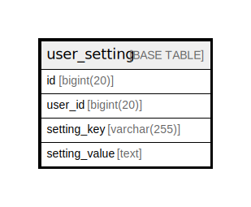

# user_setting

## 概要

<details>
<summary><strong>テーブル定義</strong></summary>

```sql
CREATE TABLE `user_setting` (
  `id` bigint(20) NOT NULL AUTO_INCREMENT,
  `user_id` bigint(20) DEFAULT NULL,
  `setting_key` varchar(255) DEFAULT NULL,
  `setting_value` text DEFAULT NULL,
  PRIMARY KEY (`id`),
  UNIQUE KEY `UQE_user_setting_key_userid` (`user_id`,`setting_key`),
  KEY `IDX_user_setting_user_id` (`user_id`),
  KEY `IDX_user_setting_setting_key` (`setting_key`)
) ENGINE=InnoDB DEFAULT CHARSET=utf8mb4 ROW_FORMAT=DYNAMIC
```

</details>

## カラム一覧

| 名前            | タイプ          | デフォルト値       | NULL許可   | Extra Definition | 子テーブル      | 親テーブル      | コメント     |
| ------------- | ------------ | ------------ | -------- | ---------------- | ---------- | ---------- | -------- |
| id            | bigint(20)   |              | false    | auto_increment   |            |            |          |
| user_id       | bigint(20)   | NULL         | true     |                  |            |            |          |
| setting_key   | varchar(255) | NULL         | true     |                  |            |            |          |
| setting_value | text         | NULL         | true     |                  |            |            |          |

## 制約一覧

| 名前                          | タイプ         | 定義                                                            |
| --------------------------- | ----------- | ------------------------------------------------------------- |
| PRIMARY                     | PRIMARY KEY | PRIMARY KEY (id)                                              |
| UQE_user_setting_key_userid | UNIQUE      | UNIQUE KEY UQE_user_setting_key_userid (user_id, setting_key) |

## INDEX一覧

| 名前                           | 定義                                                                        |
| ---------------------------- | ------------------------------------------------------------------------- |
| IDX_user_setting_setting_key | KEY IDX_user_setting_setting_key (setting_key) USING BTREE                |
| IDX_user_setting_user_id     | KEY IDX_user_setting_user_id (user_id) USING BTREE                        |
| PRIMARY                      | PRIMARY KEY (id) USING BTREE                                              |
| UQE_user_setting_key_userid  | UNIQUE KEY UQE_user_setting_key_userid (user_id, setting_key) USING BTREE |

## ER図



---

> Generated by [tbls](https://github.com/k1LoW/tbls)
