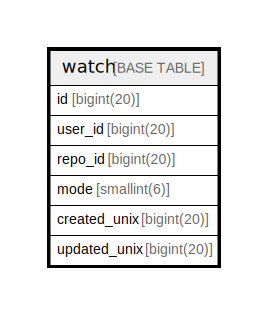

# watch

## 概要

<details>
<summary><strong>テーブル定義</strong></summary>

```sql
CREATE TABLE `watch` (
  `id` bigint(20) NOT NULL AUTO_INCREMENT,
  `user_id` bigint(20) DEFAULT NULL,
  `repo_id` bigint(20) DEFAULT NULL,
  `mode` smallint(6) NOT NULL DEFAULT 1,
  `created_unix` bigint(20) DEFAULT NULL,
  `updated_unix` bigint(20) DEFAULT NULL,
  PRIMARY KEY (`id`),
  UNIQUE KEY `UQE_watch_watch` (`user_id`,`repo_id`),
  KEY `IDX_watch_updated_unix` (`updated_unix`),
  KEY `IDX_watch_created_unix` (`created_unix`)
) ENGINE=InnoDB DEFAULT CHARSET=utf8mb4 ROW_FORMAT=DYNAMIC
```

</details>

## カラム一覧

| 名前           | タイプ         | デフォルト値       | NULL許可   | Extra Definition | 子テーブル      | 親テーブル      | コメント     |
| ------------ | ----------- | ------------ | -------- | ---------------- | ---------- | ---------- | -------- |
| id           | bigint(20)  |              | false    | auto_increment   |            |            |          |
| user_id      | bigint(20)  | NULL         | true     |                  |            |            |          |
| repo_id      | bigint(20)  | NULL         | true     |                  |            |            |          |
| mode         | smallint(6) | 1            | false    |                  |            |            |          |
| created_unix | bigint(20)  | NULL         | true     |                  |            |            |          |
| updated_unix | bigint(20)  | NULL         | true     |                  |            |            |          |

## 制約一覧

| 名前              | タイプ         | 定義                                            |
| --------------- | ----------- | --------------------------------------------- |
| PRIMARY         | PRIMARY KEY | PRIMARY KEY (id)                              |
| UQE_watch_watch | UNIQUE      | UNIQUE KEY UQE_watch_watch (user_id, repo_id) |

## INDEX一覧

| 名前                     | 定義                                                        |
| ---------------------- | --------------------------------------------------------- |
| IDX_watch_created_unix | KEY IDX_watch_created_unix (created_unix) USING BTREE     |
| IDX_watch_updated_unix | KEY IDX_watch_updated_unix (updated_unix) USING BTREE     |
| PRIMARY                | PRIMARY KEY (id) USING BTREE                              |
| UQE_watch_watch        | UNIQUE KEY UQE_watch_watch (user_id, repo_id) USING BTREE |

## ER図



---

> Generated by [tbls](https://github.com/k1LoW/tbls)
