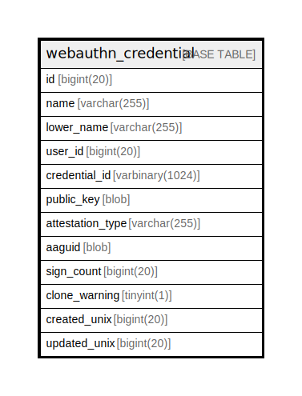

# webauthn_credential

## 概要

<details>
<summary><strong>テーブル定義</strong></summary>

```sql
CREATE TABLE `webauthn_credential` (
  `id` bigint(20) NOT NULL AUTO_INCREMENT,
  `name` varchar(255) DEFAULT NULL,
  `lower_name` varchar(255) DEFAULT NULL,
  `user_id` bigint(20) DEFAULT NULL,
  `credential_id` varbinary(1024) DEFAULT NULL,
  `public_key` blob DEFAULT NULL,
  `attestation_type` varchar(255) DEFAULT NULL,
  `aaguid` blob DEFAULT NULL,
  `sign_count` bigint(20) DEFAULT NULL,
  `clone_warning` tinyint(1) DEFAULT NULL,
  `created_unix` bigint(20) DEFAULT NULL,
  `updated_unix` bigint(20) DEFAULT NULL,
  PRIMARY KEY (`id`),
  UNIQUE KEY `UQE_webauthn_credential_s` (`lower_name`,`user_id`),
  KEY `IDX_webauthn_credential_user_id` (`user_id`),
  KEY `IDX_webauthn_credential_credential_id` (`credential_id`),
  KEY `IDX_webauthn_credential_created_unix` (`created_unix`),
  KEY `IDX_webauthn_credential_updated_unix` (`updated_unix`)
) ENGINE=InnoDB DEFAULT CHARSET=utf8mb4 ROW_FORMAT=DYNAMIC
```

</details>

## カラム一覧

| 名前               | タイプ             | デフォルト値       | NULL許可   | Extra Definition | 子テーブル      | 親テーブル      | コメント     |
| ---------------- | --------------- | ------------ | -------- | ---------------- | ---------- | ---------- | -------- |
| id               | bigint(20)      |              | false    | auto_increment   |            |            |          |
| name             | varchar(255)    | NULL         | true     |                  |            |            |          |
| lower_name       | varchar(255)    | NULL         | true     |                  |            |            |          |
| user_id          | bigint(20)      | NULL         | true     |                  |            |            |          |
| credential_id    | varbinary(1024) | NULL         | true     |                  |            |            |          |
| public_key       | blob            | NULL         | true     |                  |            |            |          |
| attestation_type | varchar(255)    | NULL         | true     |                  |            |            |          |
| aaguid           | blob            | NULL         | true     |                  |            |            |          |
| sign_count       | bigint(20)      | NULL         | true     |                  |            |            |          |
| clone_warning    | tinyint(1)      | NULL         | true     |                  |            |            |          |
| created_unix     | bigint(20)      | NULL         | true     |                  |            |            |          |
| updated_unix     | bigint(20)      | NULL         | true     |                  |            |            |          |

## 制約一覧

| 名前                        | タイプ         | 定義                                                         |
| ------------------------- | ----------- | ---------------------------------------------------------- |
| PRIMARY                   | PRIMARY KEY | PRIMARY KEY (id)                                           |
| UQE_webauthn_credential_s | UNIQUE      | UNIQUE KEY UQE_webauthn_credential_s (lower_name, user_id) |

## INDEX一覧

| 名前                                    | 定義                                                                     |
| ------------------------------------- | ---------------------------------------------------------------------- |
| IDX_webauthn_credential_created_unix  | KEY IDX_webauthn_credential_created_unix (created_unix) USING BTREE    |
| IDX_webauthn_credential_credential_id | KEY IDX_webauthn_credential_credential_id (credential_id) USING BTREE  |
| IDX_webauthn_credential_updated_unix  | KEY IDX_webauthn_credential_updated_unix (updated_unix) USING BTREE    |
| IDX_webauthn_credential_user_id       | KEY IDX_webauthn_credential_user_id (user_id) USING BTREE              |
| PRIMARY                               | PRIMARY KEY (id) USING BTREE                                           |
| UQE_webauthn_credential_s             | UNIQUE KEY UQE_webauthn_credential_s (lower_name, user_id) USING BTREE |

## ER図



---

> Generated by [tbls](https://github.com/k1LoW/tbls)
