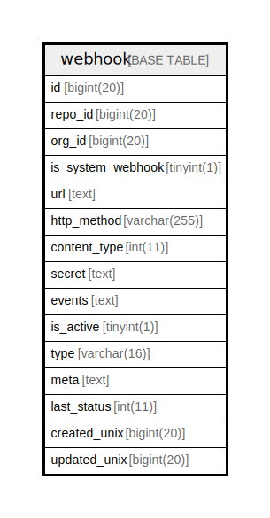

# webhook

## 概要

<details>
<summary><strong>テーブル定義</strong></summary>

```sql
CREATE TABLE `webhook` (
  `id` bigint(20) NOT NULL AUTO_INCREMENT,
  `repo_id` bigint(20) DEFAULT NULL,
  `org_id` bigint(20) DEFAULT NULL,
  `is_system_webhook` tinyint(1) DEFAULT NULL,
  `url` text DEFAULT NULL,
  `http_method` varchar(255) DEFAULT NULL,
  `content_type` int(11) DEFAULT NULL,
  `secret` text DEFAULT NULL,
  `events` text DEFAULT NULL,
  `is_active` tinyint(1) DEFAULT NULL,
  `type` varchar(16) DEFAULT NULL,
  `meta` text DEFAULT NULL,
  `last_status` int(11) DEFAULT NULL,
  `created_unix` bigint(20) DEFAULT NULL,
  `updated_unix` bigint(20) DEFAULT NULL,
  PRIMARY KEY (`id`),
  KEY `IDX_webhook_repo_id` (`repo_id`),
  KEY `IDX_webhook_org_id` (`org_id`),
  KEY `IDX_webhook_is_active` (`is_active`),
  KEY `IDX_webhook_created_unix` (`created_unix`),
  KEY `IDX_webhook_updated_unix` (`updated_unix`)
) ENGINE=InnoDB DEFAULT CHARSET=utf8mb4 ROW_FORMAT=DYNAMIC
```

</details>

## カラム一覧

| 名前                | タイプ          | デフォルト値       | NULL許可   | Extra Definition | 子テーブル      | 親テーブル      | コメント     |
| ----------------- | ------------ | ------------ | -------- | ---------------- | ---------- | ---------- | -------- |
| id                | bigint(20)   |              | false    | auto_increment   |            |            |          |
| repo_id           | bigint(20)   | NULL         | true     |                  |            |            |          |
| org_id            | bigint(20)   | NULL         | true     |                  |            |            |          |
| is_system_webhook | tinyint(1)   | NULL         | true     |                  |            |            |          |
| url               | text         | NULL         | true     |                  |            |            |          |
| http_method       | varchar(255) | NULL         | true     |                  |            |            |          |
| content_type      | int(11)      | NULL         | true     |                  |            |            |          |
| secret            | text         | NULL         | true     |                  |            |            |          |
| events            | text         | NULL         | true     |                  |            |            |          |
| is_active         | tinyint(1)   | NULL         | true     |                  |            |            |          |
| type              | varchar(16)  | NULL         | true     |                  |            |            |          |
| meta              | text         | NULL         | true     |                  |            |            |          |
| last_status       | int(11)      | NULL         | true     |                  |            |            |          |
| created_unix      | bigint(20)   | NULL         | true     |                  |            |            |          |
| updated_unix      | bigint(20)   | NULL         | true     |                  |            |            |          |

## 制約一覧

| 名前      | タイプ         | 定義               |
| ------- | ----------- | ---------------- |
| PRIMARY | PRIMARY KEY | PRIMARY KEY (id) |

## INDEX一覧

| 名前                       | 定義                                                      |
| ------------------------ | ------------------------------------------------------- |
| IDX_webhook_created_unix | KEY IDX_webhook_created_unix (created_unix) USING BTREE |
| IDX_webhook_is_active    | KEY IDX_webhook_is_active (is_active) USING BTREE       |
| IDX_webhook_org_id       | KEY IDX_webhook_org_id (org_id) USING BTREE             |
| IDX_webhook_repo_id      | KEY IDX_webhook_repo_id (repo_id) USING BTREE           |
| IDX_webhook_updated_unix | KEY IDX_webhook_updated_unix (updated_unix) USING BTREE |
| PRIMARY                  | PRIMARY KEY (id) USING BTREE                            |

## ER図



---

> Generated by [tbls](https://github.com/k1LoW/tbls)
