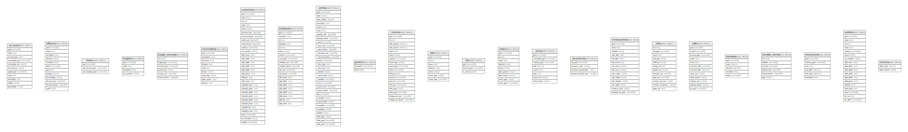

# Database Schema

## テーブル一覧

| 名前                                      | カラム一覧      | コメント     | タイプ        |
| --------------------------------------- | ---------- | -------- | ---------- |
| [accounts](accounts.md)                 | 11         |          | BASE TABLE |
| [billterms](billterms.md)               | 12         |          | BASE TABLE |
| [books](books.md)                       | 3          |          | BASE TABLE |
| [budgets](budgets.md)                   | 4          |          | BASE TABLE |
| [budget_amounts](budget_amounts.md)     | 6          |          | BASE TABLE |
| [commodities](commodities.md)           | 9          |          | BASE TABLE |
| [customers](customers.md)               | 30         |          | BASE TABLE |
| [employees](employees.md)               | 20         |          | BASE TABLE |
| [entries](entries.md)                   | 31         |          | BASE TABLE |
| [gnclock](gnclock.md)                   | 2          |          | BASE TABLE |
| [invoices](invoices.md)                 | 18         |          | BASE TABLE |
| [jobs](jobs.md)                         | 7          |          | BASE TABLE |
| [lots](lots.md)                         | 3          |          | BASE TABLE |
| [orders](orders.md)                     | 9          |          | BASE TABLE |
| [prices](prices.md)                     | 8          |          | BASE TABLE |
| [recurrences](recurrences.md)           | 4          |          | BASE TABLE |
| [schedxactions](schedxactions.md)       | 14         |          | BASE TABLE |
| [slots](slots.md)                       | 12         |          | BASE TABLE |
| [splits](splits.md)                     | 12         |          | BASE TABLE |
| [taxtables](taxtables.md)               | 5          |          | BASE TABLE |
| [taxtable_entries](taxtable_entries.md) | 6          |          | BASE TABLE |
| [transactions](transactions.md)         | 6          |          | BASE TABLE |
| [vendors](vendors.md)                   | 18         |          | BASE TABLE |
| [versions](versions.md)                 | 2          |          | BASE TABLE |

## ER図

---

> Generated by [tbls](https://github.com/k1LoW/tbls)
