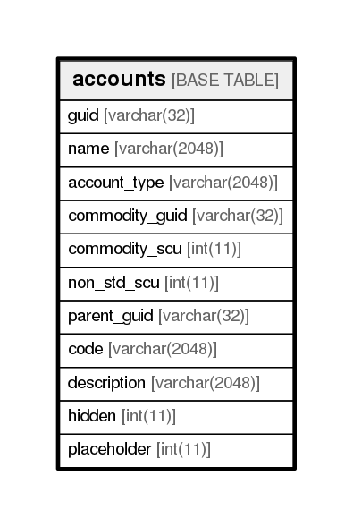

# accounts

## Description

<details>
<summary><strong>Table Definition</strong></summary>

```sql
CREATE TABLE `accounts` (
  `guid` varchar(32) NOT NULL,
  `name` varchar(2048) NOT NULL,
  `account_type` varchar(2048) NOT NULL,
  `commodity_guid` varchar(32) DEFAULT NULL,
  `commodity_scu` int(11) NOT NULL,
  `non_std_scu` int(11) NOT NULL,
  `parent_guid` varchar(32) DEFAULT NULL,
  `code` varchar(2048) DEFAULT NULL,
  `description` varchar(2048) DEFAULT NULL,
  `hidden` int(11) DEFAULT NULL,
  `placeholder` int(11) DEFAULT NULL,
  PRIMARY KEY (`guid`)
) ENGINE=InnoDB DEFAULT CHARSET=utf8
```

</details>

## Columns

| Name           | Type          | Default | Nullable | Children | Parents | Comment |
| -------------- | ------------- | ------- | -------- | -------- | ------- | ------- |
| guid           | varchar(32)   |         | false    |          |         |         |
| name           | varchar(2048) |         | false    |          |         |         |
| account_type   | varchar(2048) |         | false    |          |         |         |
| commodity_guid | varchar(32)   |         | true     |          |         |         |
| commodity_scu  | int(11)       |         | false    |          |         |         |
| non_std_scu    | int(11)       |         | false    |          |         |         |
| parent_guid    | varchar(32)   |         | true     |          |         |         |
| code           | varchar(2048) |         | true     |          |         |         |
| description    | varchar(2048) |         | true     |          |         |         |
| hidden         | int(11)       |         | true     |          |         |         |
| placeholder    | int(11)       |         | true     |          |         |         |

## Constraints

| Name    | Type        | Definition         |
| ------- | ----------- | ------------------ |
| PRIMARY | PRIMARY KEY | PRIMARY KEY (guid) |

## Indexes

| Name    | Definition                     |
| ------- | ------------------------------ |
| PRIMARY | PRIMARY KEY (guid) USING BTREE |

## Relations



---

> Generated by [tbls](https://github.com/k1LoW/tbls)
