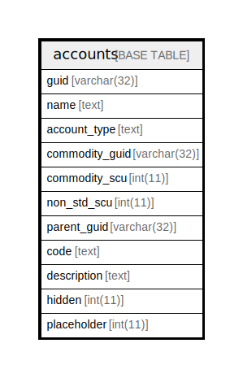

# accounts

## 概要

<details>
<summary><strong>テーブル定義</strong></summary>

```sql
CREATE TABLE `accounts` (
  `guid` varchar(32) NOT NULL,
  `name` text NOT NULL,
  `account_type` text NOT NULL,
  `commodity_guid` varchar(32) NOT NULL,
  `commodity_scu` int(11) NOT NULL,
  `non_std_scu` int(11) NOT NULL,
  `parent_guid` varchar(32) DEFAULT NULL,
  `code` text DEFAULT NULL,
  `description` text DEFAULT NULL,
  `hidden` int(11) NOT NULL,
  `placeholder` int(11) NOT NULL,
  PRIMARY KEY (`guid`)
) ENGINE=InnoDB DEFAULT CHARSET=utf8mb4 COLLATE=utf8mb4_general_ci
```

</details>

## カラム一覧

| 名前             | タイプ         | デフォルト値       | NULL許可   | 子テーブル      | 親テーブル      | コメント     |
| -------------- | ----------- | ------------ | -------- | ---------- | ---------- | -------- |
| guid           | varchar(32) |              | false    |            |            |          |
| name           | text        |              | false    |            |            |          |
| account_type   | text        |              | false    |            |            |          |
| commodity_guid | varchar(32) |              | false    |            |            |          |
| commodity_scu  | int(11)     |              | false    |            |            |          |
| non_std_scu    | int(11)     |              | false    |            |            |          |
| parent_guid    | varchar(32) | NULL         | true     |            |            |          |
| code           | text        | NULL         | true     |            |            |          |
| description    | text        | NULL         | true     |            |            |          |
| hidden         | int(11)     |              | false    |            |            |          |
| placeholder    | int(11)     |              | false    |            |            |          |

## 制約一覧

| 名前      | タイプ         | 定義                 |
| ------- | ----------- | ------------------ |
| PRIMARY | PRIMARY KEY | PRIMARY KEY (guid) |

## INDEX一覧

| 名前      | 定義                             |
| ------- | ------------------------------ |
| PRIMARY | PRIMARY KEY (guid) USING BTREE |

## ER図



---

> Generated by [tbls](https://github.com/k1LoW/tbls)
