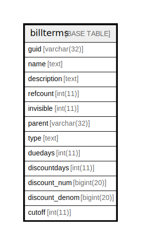

# billterms

## 概要

<details>
<summary><strong>テーブル定義</strong></summary>

```sql
CREATE TABLE `billterms` (
  `guid` text NOT NULL,
  `name` text NOT NULL,
  `description` text NOT NULL,
  `refcount` int(11) NOT NULL,
  `invisible` int(11) NOT NULL,
  `parent` text DEFAULT NULL,
  `type` text NOT NULL,
  `duedays` int(11) DEFAULT NULL,
  `discountdays` int(11) DEFAULT NULL,
  `discount_num` bigint(20) DEFAULT NULL,
  `discount_denom` bigint(20) DEFAULT NULL,
  `cutoff` int(11) DEFAULT NULL,
  PRIMARY KEY (`guid`(255))
) ENGINE=InnoDB DEFAULT CHARSET=utf8mb4 COLLATE=utf8mb4_general_ci
```

</details>

## カラム一覧

| 名前             | タイプ        | デフォルト値       | NULL許可   | 子テーブル      | 親テーブル      | コメント     |
| -------------- | ---------- | ------------ | -------- | ---------- | ---------- | -------- |
| guid           | text       |              | false    |            |            |          |
| name           | text       |              | false    |            |            |          |
| description    | text       |              | false    |            |            |          |
| refcount       | int(11)    |              | false    |            |            |          |
| invisible      | int(11)    |              | false    |            |            |          |
| parent         | text       | NULL         | true     |            |            |          |
| type           | text       |              | false    |            |            |          |
| duedays        | int(11)    | NULL         | true     |            |            |          |
| discountdays   | int(11)    | NULL         | true     |            |            |          |
| discount_num   | bigint(20) | NULL         | true     |            |            |          |
| discount_denom | bigint(20) | NULL         | true     |            |            |          |
| cutoff         | int(11)    | NULL         | true     |            |            |          |

## 制約一覧

| 名前      | タイプ         | 定義                 |
| ------- | ----------- | ------------------ |
| PRIMARY | PRIMARY KEY | PRIMARY KEY (guid) |

## INDEX一覧

| 名前      | 定義                             |
| ------- | ------------------------------ |
| PRIMARY | PRIMARY KEY (guid) USING BTREE |

## ER図



---

> Generated by [tbls](https://github.com/k1LoW/tbls)
