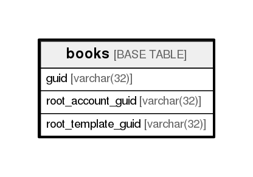

# books

## Description

<details>
<summary><strong>Table Definition</strong></summary>

```sql
CREATE TABLE `books` (
  `guid` varchar(32) NOT NULL,
  `root_account_guid` varchar(32) NOT NULL,
  `root_template_guid` varchar(32) NOT NULL,
  PRIMARY KEY (`guid`)
) ENGINE=InnoDB DEFAULT CHARSET=utf8
```

</details>

## Columns

| Name               | Type        | Default | Nullable | Children | Parents | Comment |
| ------------------ | ----------- | ------- | -------- | -------- | ------- | ------- |
| guid               | varchar(32) |         | false    |          |         |         |
| root_account_guid  | varchar(32) |         | false    |          |         |         |
| root_template_guid | varchar(32) |         | false    |          |         |         |

## Constraints

| Name    | Type        | Definition         |
| ------- | ----------- | ------------------ |
| PRIMARY | PRIMARY KEY | PRIMARY KEY (guid) |

## Indexes

| Name    | Definition                     |
| ------- | ------------------------------ |
| PRIMARY | PRIMARY KEY (guid) USING BTREE |

## Relations



---

> Generated by [tbls](https://github.com/k1LoW/tbls)
