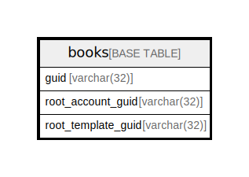

# books

## 概要

<details>
<summary><strong>テーブル定義</strong></summary>

```sql
CREATE TABLE `books` (
  `guid` varchar(32) NOT NULL,
  `root_account_guid` varchar(32) NOT NULL,
  `root_template_guid` varchar(32) NOT NULL,
  PRIMARY KEY (`guid`)
) ENGINE=InnoDB DEFAULT CHARSET=utf8mb4 COLLATE=utf8mb4_general_ci
```

</details>

## カラム一覧

| 名前                 | タイプ         | デフォルト値       | NULL許可   | 子テーブル      | 親テーブル      | コメント     |
| ------------------ | ----------- | ------------ | -------- | ---------- | ---------- | -------- |
| guid               | varchar(32) |              | false    |            |            |          |
| root_account_guid  | varchar(32) |              | false    |            |            |          |
| root_template_guid | varchar(32) |              | false    |            |            |          |

## 制約一覧

| 名前      | タイプ         | 定義                 |
| ------- | ----------- | ------------------ |
| PRIMARY | PRIMARY KEY | PRIMARY KEY (guid) |

## INDEX一覧

| 名前      | 定義                             |
| ------- | ------------------------------ |
| PRIMARY | PRIMARY KEY (guid) USING BTREE |

## ER図



---

> Generated by [tbls](https://github.com/k1LoW/tbls)
