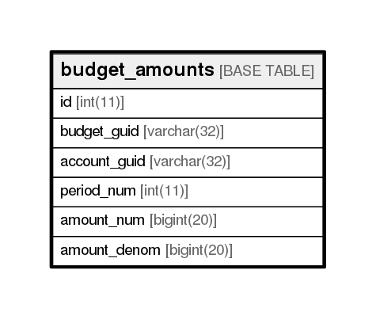

# budget_amounts

## Description

<details>
<summary><strong>Table Definition</strong></summary>

```sql
CREATE TABLE `budget_amounts` (
  `id` int(11) NOT NULL AUTO_INCREMENT,
  `budget_guid` varchar(32) NOT NULL,
  `account_guid` varchar(32) NOT NULL,
  `period_num` int(11) NOT NULL,
  `amount_num` bigint(20) NOT NULL,
  `amount_denom` bigint(20) NOT NULL,
  PRIMARY KEY (`id`)
) ENGINE=InnoDB DEFAULT CHARSET=utf8
```

</details>

## Columns

| Name         | Type        | Default | Nullable | Children | Parents | Comment |
| ------------ | ----------- | ------- | -------- | -------- | ------- | ------- |
| id           | int(11)     |         | false    |          |         |         |
| budget_guid  | varchar(32) |         | false    |          |         |         |
| account_guid | varchar(32) |         | false    |          |         |         |
| period_num   | int(11)     |         | false    |          |         |         |
| amount_num   | bigint(20)  |         | false    |          |         |         |
| amount_denom | bigint(20)  |         | false    |          |         |         |

## Constraints

| Name    | Type        | Definition       |
| ------- | ----------- | ---------------- |
| PRIMARY | PRIMARY KEY | PRIMARY KEY (id) |

## Indexes

| Name    | Definition                   |
| ------- | ---------------------------- |
| PRIMARY | PRIMARY KEY (id) USING BTREE |

## Relations



---

> Generated by [tbls](https://github.com/k1LoW/tbls)
