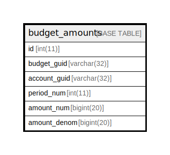

# budget_amounts

## 概要

<details>
<summary><strong>テーブル定義</strong></summary>

```sql
CREATE TABLE `budget_amounts` (
  `id` int(11) NOT NULL AUTO_INCREMENT,
  `budget_guid` varchar(32) NOT NULL,
  `account_guid` varchar(32) NOT NULL,
  `period_num` int(11) NOT NULL,
  `amount_num` bigint(20) NOT NULL,
  `amount_denom` bigint(20) NOT NULL,
  PRIMARY KEY (`id`)
) ENGINE=InnoDB DEFAULT CHARSET=utf8mb4 COLLATE=utf8mb4_general_ci
```

</details>

## カラム一覧

| 名前           | タイプ         | デフォルト値       | NULL許可   | Extra Definition | 子テーブル      | 親テーブル      | コメント     |
| ------------ | ----------- | ------------ | -------- | ---------------- | ---------- | ---------- | -------- |
| id           | int(11)     |              | false    | auto_increment   |            |            |          |
| budget_guid  | varchar(32) |              | false    |                  |            |            |          |
| account_guid | varchar(32) |              | false    |                  |            |            |          |
| period_num   | int(11)     |              | false    |                  |            |            |          |
| amount_num   | bigint(20)  |              | false    |                  |            |            |          |
| amount_denom | bigint(20)  |              | false    |                  |            |            |          |

## 制約一覧

| 名前      | タイプ         | 定義               |
| ------- | ----------- | ---------------- |
| PRIMARY | PRIMARY KEY | PRIMARY KEY (id) |

## INDEX一覧

| 名前      | 定義                           |
| ------- | ---------------------------- |
| PRIMARY | PRIMARY KEY (id) USING BTREE |

## ER図



---

> Generated by [tbls](https://github.com/k1LoW/tbls)
