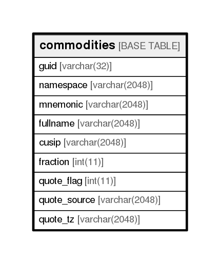

# commodities

## Description

<details>
<summary><strong>Table Definition</strong></summary>

```sql
CREATE TABLE `commodities` (
  `guid` varchar(32) NOT NULL,
  `namespace` varchar(2048) NOT NULL,
  `mnemonic` varchar(2048) NOT NULL,
  `fullname` varchar(2048) DEFAULT NULL,
  `cusip` varchar(2048) DEFAULT NULL,
  `fraction` int(11) NOT NULL,
  `quote_flag` int(11) NOT NULL,
  `quote_source` varchar(2048) DEFAULT NULL,
  `quote_tz` varchar(2048) DEFAULT NULL,
  PRIMARY KEY (`guid`)
) ENGINE=InnoDB DEFAULT CHARSET=utf8
```

</details>

## Columns

| Name         | Type          | Default | Nullable | Children | Parents | Comment |
| ------------ | ------------- | ------- | -------- | -------- | ------- | ------- |
| guid         | varchar(32)   |         | false    |          |         |         |
| namespace    | varchar(2048) |         | false    |          |         |         |
| mnemonic     | varchar(2048) |         | false    |          |         |         |
| fullname     | varchar(2048) |         | true     |          |         |         |
| cusip        | varchar(2048) |         | true     |          |         |         |
| fraction     | int(11)       |         | false    |          |         |         |
| quote_flag   | int(11)       |         | false    |          |         |         |
| quote_source | varchar(2048) |         | true     |          |         |         |
| quote_tz     | varchar(2048) |         | true     |          |         |         |

## Constraints

| Name    | Type        | Definition         |
| ------- | ----------- | ------------------ |
| PRIMARY | PRIMARY KEY | PRIMARY KEY (guid) |

## Indexes

| Name    | Definition                     |
| ------- | ------------------------------ |
| PRIMARY | PRIMARY KEY (guid) USING BTREE |

## Relations



---

> Generated by [tbls](https://github.com/k1LoW/tbls)
