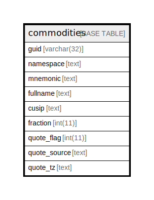

# commodities

## 概要

<details>
<summary><strong>テーブル定義</strong></summary>

```sql
CREATE TABLE `commodities` (
  `guid` varchar(32) NOT NULL,
  `namespace` text NOT NULL,
  `mnemonic` text NOT NULL,
  `fullname` text DEFAULT NULL,
  `cusip` text DEFAULT NULL,
  `fraction` int(11) NOT NULL,
  `quote_flag` int(11) NOT NULL,
  `quote_source` text DEFAULT NULL,
  `quote_tz` text DEFAULT NULL,
  PRIMARY KEY (`guid`)
) ENGINE=InnoDB DEFAULT CHARSET=utf8mb4 COLLATE=utf8mb4_general_ci
```

</details>

## カラム一覧

| 名前           | タイプ         | デフォルト値       | NULL許可   | 子テーブル      | 親テーブル      | コメント     |
| ------------ | ----------- | ------------ | -------- | ---------- | ---------- | -------- |
| guid         | varchar(32) |              | false    |            |            |          |
| namespace    | text        |              | false    |            |            |          |
| mnemonic     | text        |              | false    |            |            |          |
| fullname     | text        | NULL         | true     |            |            |          |
| cusip        | text        | NULL         | true     |            |            |          |
| fraction     | int(11)     |              | false    |            |            |          |
| quote_flag   | int(11)     |              | false    |            |            |          |
| quote_source | text        | NULL         | true     |            |            |          |
| quote_tz     | text        | NULL         | true     |            |            |          |

## 制約一覧

| 名前      | タイプ         | 定義                 |
| ------- | ----------- | ------------------ |
| PRIMARY | PRIMARY KEY | PRIMARY KEY (guid) |

## INDEX一覧

| 名前      | 定義                             |
| ------- | ------------------------------ |
| PRIMARY | PRIMARY KEY (guid) USING BTREE |

## ER図



---

> Generated by [tbls](https://github.com/k1LoW/tbls)
