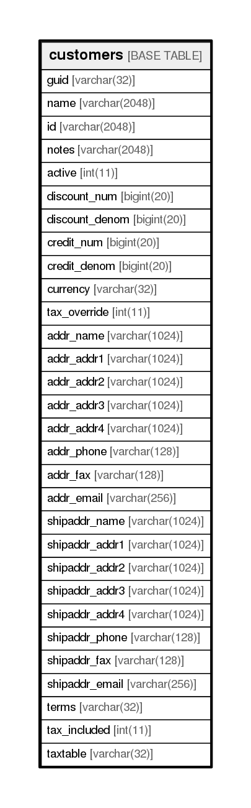

# customers

## Description

<details>
<summary><strong>Table Definition</strong></summary>

```sql
CREATE TABLE `customers` (
  `guid` varchar(32) NOT NULL,
  `name` varchar(2048) NOT NULL,
  `id` varchar(2048) NOT NULL,
  `notes` varchar(2048) NOT NULL,
  `active` int(11) NOT NULL,
  `discount_num` bigint(20) NOT NULL,
  `discount_denom` bigint(20) NOT NULL,
  `credit_num` bigint(20) NOT NULL,
  `credit_denom` bigint(20) NOT NULL,
  `currency` varchar(32) NOT NULL,
  `tax_override` int(11) NOT NULL,
  `addr_name` varchar(1024) DEFAULT NULL,
  `addr_addr1` varchar(1024) DEFAULT NULL,
  `addr_addr2` varchar(1024) DEFAULT NULL,
  `addr_addr3` varchar(1024) DEFAULT NULL,
  `addr_addr4` varchar(1024) DEFAULT NULL,
  `addr_phone` varchar(128) DEFAULT NULL,
  `addr_fax` varchar(128) DEFAULT NULL,
  `addr_email` varchar(256) DEFAULT NULL,
  `shipaddr_name` varchar(1024) DEFAULT NULL,
  `shipaddr_addr1` varchar(1024) DEFAULT NULL,
  `shipaddr_addr2` varchar(1024) DEFAULT NULL,
  `shipaddr_addr3` varchar(1024) DEFAULT NULL,
  `shipaddr_addr4` varchar(1024) DEFAULT NULL,
  `shipaddr_phone` varchar(128) DEFAULT NULL,
  `shipaddr_fax` varchar(128) DEFAULT NULL,
  `shipaddr_email` varchar(256) DEFAULT NULL,
  `terms` varchar(32) DEFAULT NULL,
  `tax_included` int(11) DEFAULT NULL,
  `taxtable` varchar(32) DEFAULT NULL,
  PRIMARY KEY (`guid`)
) ENGINE=InnoDB DEFAULT CHARSET=utf8
```

</details>

## Columns

| Name           | Type          | Default | Nullable | Children | Parents | Comment |
| -------------- | ------------- | ------- | -------- | -------- | ------- | ------- |
| guid           | varchar(32)   |         | false    |          |         |         |
| name           | varchar(2048) |         | false    |          |         |         |
| id             | varchar(2048) |         | false    |          |         |         |
| notes          | varchar(2048) |         | false    |          |         |         |
| active         | int(11)       |         | false    |          |         |         |
| discount_num   | bigint(20)    |         | false    |          |         |         |
| discount_denom | bigint(20)    |         | false    |          |         |         |
| credit_num     | bigint(20)    |         | false    |          |         |         |
| credit_denom   | bigint(20)    |         | false    |          |         |         |
| currency       | varchar(32)   |         | false    |          |         |         |
| tax_override   | int(11)       |         | false    |          |         |         |
| addr_name      | varchar(1024) |         | true     |          |         |         |
| addr_addr1     | varchar(1024) |         | true     |          |         |         |
| addr_addr2     | varchar(1024) |         | true     |          |         |         |
| addr_addr3     | varchar(1024) |         | true     |          |         |         |
| addr_addr4     | varchar(1024) |         | true     |          |         |         |
| addr_phone     | varchar(128)  |         | true     |          |         |         |
| addr_fax       | varchar(128)  |         | true     |          |         |         |
| addr_email     | varchar(256)  |         | true     |          |         |         |
| shipaddr_name  | varchar(1024) |         | true     |          |         |         |
| shipaddr_addr1 | varchar(1024) |         | true     |          |         |         |
| shipaddr_addr2 | varchar(1024) |         | true     |          |         |         |
| shipaddr_addr3 | varchar(1024) |         | true     |          |         |         |
| shipaddr_addr4 | varchar(1024) |         | true     |          |         |         |
| shipaddr_phone | varchar(128)  |         | true     |          |         |         |
| shipaddr_fax   | varchar(128)  |         | true     |          |         |         |
| shipaddr_email | varchar(256)  |         | true     |          |         |         |
| terms          | varchar(32)   |         | true     |          |         |         |
| tax_included   | int(11)       |         | true     |          |         |         |
| taxtable       | varchar(32)   |         | true     |          |         |         |

## Constraints

| Name    | Type        | Definition         |
| ------- | ----------- | ------------------ |
| PRIMARY | PRIMARY KEY | PRIMARY KEY (guid) |

## Indexes

| Name    | Definition                     |
| ------- | ------------------------------ |
| PRIMARY | PRIMARY KEY (guid) USING BTREE |

## Relations



---

> Generated by [tbls](https://github.com/k1LoW/tbls)
