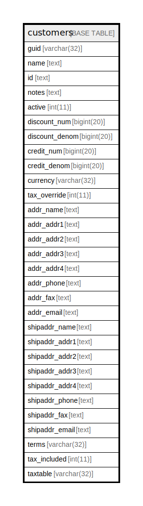

# customers

## 概要

<details>
<summary><strong>テーブル定義</strong></summary>

```sql
CREATE TABLE `customers` (
  `guid` varchar(32) NOT NULL,
  `name` text NOT NULL,
  `id` text NOT NULL,
  `notes` text NOT NULL,
  `active` int(11) NOT NULL,
  `discount_num` bigint(20) NOT NULL,
  `discount_denom` bigint(20) NOT NULL,
  `credit_num` bigint(20) NOT NULL,
  `credit_denom` bigint(20) NOT NULL,
  `currency` varchar(32) NOT NULL,
  `tax_override` int(11) NOT NULL,
  `addr_name` text DEFAULT NULL,
  `addr_addr1` text DEFAULT NULL,
  `addr_addr2` text DEFAULT NULL,
  `addr_addr3` text DEFAULT NULL,
  `addr_addr4` text DEFAULT NULL,
  `addr_phone` text DEFAULT NULL,
  `addr_fax` text DEFAULT NULL,
  `addr_email` text DEFAULT NULL,
  `shipaddr_name` text DEFAULT NULL,
  `shipaddr_addr1` text DEFAULT NULL,
  `shipaddr_addr2` text DEFAULT NULL,
  `shipaddr_addr3` text DEFAULT NULL,
  `shipaddr_addr4` text DEFAULT NULL,
  `shipaddr_phone` text DEFAULT NULL,
  `shipaddr_fax` text DEFAULT NULL,
  `shipaddr_email` text DEFAULT NULL,
  `terms` varchar(32) DEFAULT NULL,
  `tax_included` int(11) DEFAULT NULL,
  `taxtable` varchar(32) DEFAULT NULL,
  PRIMARY KEY (`guid`)
) ENGINE=InnoDB DEFAULT CHARSET=utf8mb4 COLLATE=utf8mb4_general_ci
```

</details>

## カラム一覧

| 名前             | タイプ         | デフォルト値       | NULL許可   | 子テーブル      | 親テーブル      | コメント     |
| -------------- | ----------- | ------------ | -------- | ---------- | ---------- | -------- |
| guid           | varchar(32) |              | false    |            |            |          |
| name           | text        |              | false    |            |            |          |
| id             | text        |              | false    |            |            |          |
| notes          | text        |              | false    |            |            |          |
| active         | int(11)     |              | false    |            |            |          |
| discount_num   | bigint(20)  |              | false    |            |            |          |
| discount_denom | bigint(20)  |              | false    |            |            |          |
| credit_num     | bigint(20)  |              | false    |            |            |          |
| credit_denom   | bigint(20)  |              | false    |            |            |          |
| currency       | varchar(32) |              | false    |            |            |          |
| tax_override   | int(11)     |              | false    |            |            |          |
| addr_name      | text        | NULL         | true     |            |            |          |
| addr_addr1     | text        | NULL         | true     |            |            |          |
| addr_addr2     | text        | NULL         | true     |            |            |          |
| addr_addr3     | text        | NULL         | true     |            |            |          |
| addr_addr4     | text        | NULL         | true     |            |            |          |
| addr_phone     | text        | NULL         | true     |            |            |          |
| addr_fax       | text        | NULL         | true     |            |            |          |
| addr_email     | text        | NULL         | true     |            |            |          |
| shipaddr_name  | text        | NULL         | true     |            |            |          |
| shipaddr_addr1 | text        | NULL         | true     |            |            |          |
| shipaddr_addr2 | text        | NULL         | true     |            |            |          |
| shipaddr_addr3 | text        | NULL         | true     |            |            |          |
| shipaddr_addr4 | text        | NULL         | true     |            |            |          |
| shipaddr_phone | text        | NULL         | true     |            |            |          |
| shipaddr_fax   | text        | NULL         | true     |            |            |          |
| shipaddr_email | text        | NULL         | true     |            |            |          |
| terms          | varchar(32) | NULL         | true     |            |            |          |
| tax_included   | int(11)     | NULL         | true     |            |            |          |
| taxtable       | varchar(32) | NULL         | true     |            |            |          |

## 制約一覧

| 名前      | タイプ         | 定義                 |
| ------- | ----------- | ------------------ |
| PRIMARY | PRIMARY KEY | PRIMARY KEY (guid) |

## INDEX一覧

| 名前      | 定義                             |
| ------- | ------------------------------ |
| PRIMARY | PRIMARY KEY (guid) USING BTREE |

## ER図



---

> Generated by [tbls](https://github.com/k1LoW/tbls)
