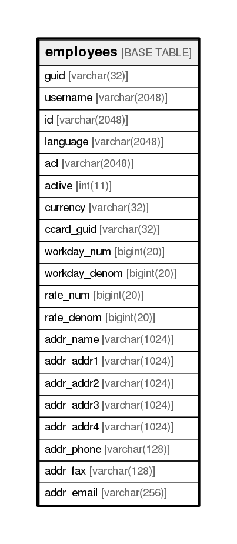

# employees

## Description

<details>
<summary><strong>Table Definition</strong></summary>

```sql
CREATE TABLE `employees` (
  `guid` varchar(32) NOT NULL,
  `username` varchar(2048) NOT NULL,
  `id` varchar(2048) NOT NULL,
  `language` varchar(2048) NOT NULL,
  `acl` varchar(2048) NOT NULL,
  `active` int(11) NOT NULL,
  `currency` varchar(32) NOT NULL,
  `ccard_guid` varchar(32) DEFAULT NULL,
  `workday_num` bigint(20) NOT NULL,
  `workday_denom` bigint(20) NOT NULL,
  `rate_num` bigint(20) NOT NULL,
  `rate_denom` bigint(20) NOT NULL,
  `addr_name` varchar(1024) DEFAULT NULL,
  `addr_addr1` varchar(1024) DEFAULT NULL,
  `addr_addr2` varchar(1024) DEFAULT NULL,
  `addr_addr3` varchar(1024) DEFAULT NULL,
  `addr_addr4` varchar(1024) DEFAULT NULL,
  `addr_phone` varchar(128) DEFAULT NULL,
  `addr_fax` varchar(128) DEFAULT NULL,
  `addr_email` varchar(256) DEFAULT NULL,
  PRIMARY KEY (`guid`)
) ENGINE=InnoDB DEFAULT CHARSET=utf8
```

</details>

## Columns

| Name          | Type          | Default | Nullable | Children | Parents | Comment |
| ------------- | ------------- | ------- | -------- | -------- | ------- | ------- |
| guid          | varchar(32)   |         | false    |          |         |         |
| username      | varchar(2048) |         | false    |          |         |         |
| id            | varchar(2048) |         | false    |          |         |         |
| language      | varchar(2048) |         | false    |          |         |         |
| acl           | varchar(2048) |         | false    |          |         |         |
| active        | int(11)       |         | false    |          |         |         |
| currency      | varchar(32)   |         | false    |          |         |         |
| ccard_guid    | varchar(32)   |         | true     |          |         |         |
| workday_num   | bigint(20)    |         | false    |          |         |         |
| workday_denom | bigint(20)    |         | false    |          |         |         |
| rate_num      | bigint(20)    |         | false    |          |         |         |
| rate_denom    | bigint(20)    |         | false    |          |         |         |
| addr_name     | varchar(1024) |         | true     |          |         |         |
| addr_addr1    | varchar(1024) |         | true     |          |         |         |
| addr_addr2    | varchar(1024) |         | true     |          |         |         |
| addr_addr3    | varchar(1024) |         | true     |          |         |         |
| addr_addr4    | varchar(1024) |         | true     |          |         |         |
| addr_phone    | varchar(128)  |         | true     |          |         |         |
| addr_fax      | varchar(128)  |         | true     |          |         |         |
| addr_email    | varchar(256)  |         | true     |          |         |         |

## Constraints

| Name    | Type        | Definition         |
| ------- | ----------- | ------------------ |
| PRIMARY | PRIMARY KEY | PRIMARY KEY (guid) |

## Indexes

| Name    | Definition                     |
| ------- | ------------------------------ |
| PRIMARY | PRIMARY KEY (guid) USING BTREE |

## Relations



---

> Generated by [tbls](https://github.com/k1LoW/tbls)
