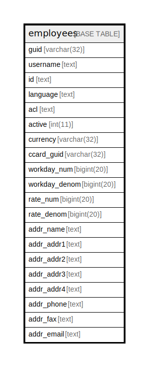

# employees

## 概要

<details>
<summary><strong>テーブル定義</strong></summary>

```sql
CREATE TABLE `employees` (
  `guid` varchar(32) NOT NULL,
  `username` text NOT NULL,
  `id` text NOT NULL,
  `language` text NOT NULL,
  `acl` text NOT NULL,
  `active` int(11) NOT NULL,
  `currency` varchar(32) NOT NULL,
  `ccard_guid` varchar(32) DEFAULT NULL,
  `workday_num` bigint(20) NOT NULL,
  `workday_denom` bigint(20) NOT NULL,
  `rate_num` bigint(20) NOT NULL,
  `rate_denom` bigint(20) NOT NULL,
  `addr_name` text DEFAULT NULL,
  `addr_addr1` text DEFAULT NULL,
  `addr_addr2` text DEFAULT NULL,
  `addr_addr3` text DEFAULT NULL,
  `addr_addr4` text DEFAULT NULL,
  `addr_phone` text DEFAULT NULL,
  `addr_fax` text DEFAULT NULL,
  `addr_email` text DEFAULT NULL,
  PRIMARY KEY (`guid`)
) ENGINE=InnoDB DEFAULT CHARSET=utf8mb4 COLLATE=utf8mb4_general_ci
```

</details>

## カラム一覧

| 名前            | タイプ         | デフォルト値       | NULL許可   | 子テーブル      | 親テーブル      | コメント     |
| ------------- | ----------- | ------------ | -------- | ---------- | ---------- | -------- |
| guid          | varchar(32) |              | false    |            |            |          |
| username      | text        |              | false    |            |            |          |
| id            | text        |              | false    |            |            |          |
| language      | text        |              | false    |            |            |          |
| acl           | text        |              | false    |            |            |          |
| active        | int(11)     |              | false    |            |            |          |
| currency      | varchar(32) |              | false    |            |            |          |
| ccard_guid    | varchar(32) | NULL         | true     |            |            |          |
| workday_num   | bigint(20)  |              | false    |            |            |          |
| workday_denom | bigint(20)  |              | false    |            |            |          |
| rate_num      | bigint(20)  |              | false    |            |            |          |
| rate_denom    | bigint(20)  |              | false    |            |            |          |
| addr_name     | text        | NULL         | true     |            |            |          |
| addr_addr1    | text        | NULL         | true     |            |            |          |
| addr_addr2    | text        | NULL         | true     |            |            |          |
| addr_addr3    | text        | NULL         | true     |            |            |          |
| addr_addr4    | text        | NULL         | true     |            |            |          |
| addr_phone    | text        | NULL         | true     |            |            |          |
| addr_fax      | text        | NULL         | true     |            |            |          |
| addr_email    | text        | NULL         | true     |            |            |          |

## 制約一覧

| 名前      | タイプ         | 定義                 |
| ------- | ----------- | ------------------ |
| PRIMARY | PRIMARY KEY | PRIMARY KEY (guid) |

## INDEX一覧

| 名前      | 定義                             |
| ------- | ------------------------------ |
| PRIMARY | PRIMARY KEY (guid) USING BTREE |

## ER図



---

> Generated by [tbls](https://github.com/k1LoW/tbls)
