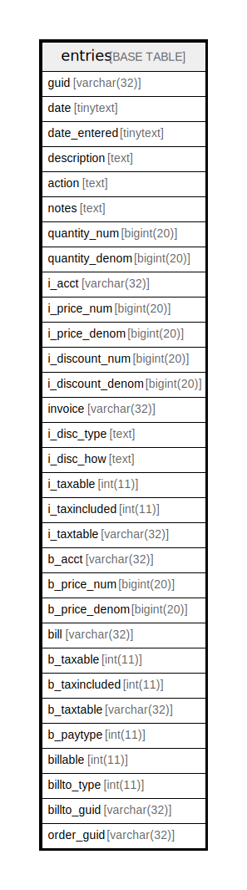

# entries

## 概要

<details>
<summary><strong>テーブル定義</strong></summary>

```sql
CREATE TABLE `entries` (
  `guid` text NOT NULL,
  `date` text NOT NULL,
  `date_entered` text DEFAULT NULL,
  `description` text DEFAULT NULL,
  `action` text DEFAULT NULL,
  `notes` text DEFAULT NULL,
  `quantity_num` bigint(20) DEFAULT NULL,
  `quantity_denom` bigint(20) DEFAULT NULL,
  `i_acct` text DEFAULT NULL,
  `i_price_num` bigint(20) DEFAULT NULL,
  `i_price_denom` bigint(20) DEFAULT NULL,
  `i_discount_num` bigint(20) DEFAULT NULL,
  `i_discount_denom` bigint(20) DEFAULT NULL,
  `invoice` text DEFAULT NULL,
  `i_disc_type` text DEFAULT NULL,
  `i_disc_how` text DEFAULT NULL,
  `i_taxable` int(11) DEFAULT NULL,
  `i_taxincluded` int(11) DEFAULT NULL,
  `i_taxtable` text DEFAULT NULL,
  `b_acct` text DEFAULT NULL,
  `b_price_num` bigint(20) DEFAULT NULL,
  `b_price_denom` bigint(20) DEFAULT NULL,
  `bill` text DEFAULT NULL,
  `b_taxable` int(11) DEFAULT NULL,
  `b_taxincluded` int(11) DEFAULT NULL,
  `b_taxtable` text DEFAULT NULL,
  `b_paytype` int(11) DEFAULT NULL,
  `billable` int(11) DEFAULT NULL,
  `billto_type` int(11) DEFAULT NULL,
  `billto_guid` text DEFAULT NULL,
  `order_guid` text DEFAULT NULL,
  PRIMARY KEY (`guid`(255))
) ENGINE=InnoDB DEFAULT CHARSET=utf8mb4 COLLATE=utf8mb4_general_ci
```

</details>

## カラム一覧

| 名前               | タイプ        | デフォルト値       | NULL許可   | 子テーブル      | 親テーブル      | コメント     |
| ---------------- | ---------- | ------------ | -------- | ---------- | ---------- | -------- |
| guid             | text       |              | false    |            |            |          |
| date             | text       |              | false    |            |            |          |
| date_entered     | text       | NULL         | true     |            |            |          |
| description      | text       | NULL         | true     |            |            |          |
| action           | text       | NULL         | true     |            |            |          |
| notes            | text       | NULL         | true     |            |            |          |
| quantity_num     | bigint(20) | NULL         | true     |            |            |          |
| quantity_denom   | bigint(20) | NULL         | true     |            |            |          |
| i_acct           | text       | NULL         | true     |            |            |          |
| i_price_num      | bigint(20) | NULL         | true     |            |            |          |
| i_price_denom    | bigint(20) | NULL         | true     |            |            |          |
| i_discount_num   | bigint(20) | NULL         | true     |            |            |          |
| i_discount_denom | bigint(20) | NULL         | true     |            |            |          |
| invoice          | text       | NULL         | true     |            |            |          |
| i_disc_type      | text       | NULL         | true     |            |            |          |
| i_disc_how       | text       | NULL         | true     |            |            |          |
| i_taxable        | int(11)    | NULL         | true     |            |            |          |
| i_taxincluded    | int(11)    | NULL         | true     |            |            |          |
| i_taxtable       | text       | NULL         | true     |            |            |          |
| b_acct           | text       | NULL         | true     |            |            |          |
| b_price_num      | bigint(20) | NULL         | true     |            |            |          |
| b_price_denom    | bigint(20) | NULL         | true     |            |            |          |
| bill             | text       | NULL         | true     |            |            |          |
| b_taxable        | int(11)    | NULL         | true     |            |            |          |
| b_taxincluded    | int(11)    | NULL         | true     |            |            |          |
| b_taxtable       | text       | NULL         | true     |            |            |          |
| b_paytype        | int(11)    | NULL         | true     |            |            |          |
| billable         | int(11)    | NULL         | true     |            |            |          |
| billto_type      | int(11)    | NULL         | true     |            |            |          |
| billto_guid      | text       | NULL         | true     |            |            |          |
| order_guid       | text       | NULL         | true     |            |            |          |

## 制約一覧

| 名前      | タイプ         | 定義                 |
| ------- | ----------- | ------------------ |
| PRIMARY | PRIMARY KEY | PRIMARY KEY (guid) |

## INDEX一覧

| 名前      | 定義                             |
| ------- | ------------------------------ |
| PRIMARY | PRIMARY KEY (guid) USING BTREE |

## ER図



---

> Generated by [tbls](https://github.com/k1LoW/tbls)
