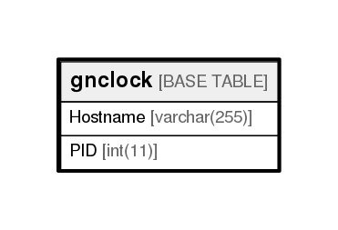

# gnclock

## Description

<details>
<summary><strong>Table Definition</strong></summary>

```sql
CREATE TABLE `gnclock` (
  `Hostname` varchar(255) DEFAULT NULL,
  `PID` int(11) DEFAULT NULL
) ENGINE=InnoDB DEFAULT CHARSET=utf8
```

</details>

## Columns

| Name     | Type         | Default | Nullable | Children | Parents | Comment |
| -------- | ------------ | ------- | -------- | -------- | ------- | ------- |
| Hostname | varchar(255) |         | true     |          |         |         |
| PID      | int(11)      |         | true     |          |         |         |

## Relations



---

> Generated by [tbls](https://github.com/k1LoW/tbls)
