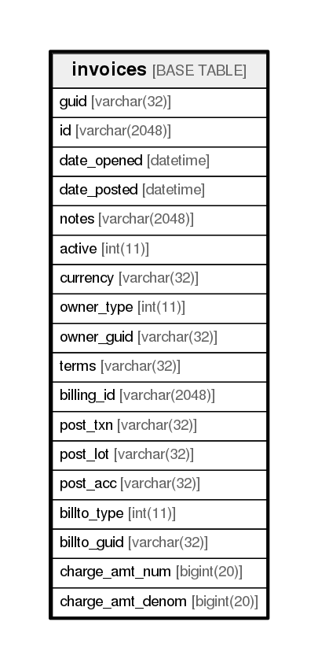

# invoices

## Description

<details>
<summary><strong>Table Definition</strong></summary>

```sql
CREATE TABLE `invoices` (
  `guid` varchar(32) NOT NULL,
  `id` varchar(2048) NOT NULL,
  `date_opened` datetime DEFAULT '1970-01-01 00:00:00',
  `date_posted` datetime DEFAULT '1970-01-01 00:00:00',
  `notes` varchar(2048) NOT NULL,
  `active` int(11) NOT NULL,
  `currency` varchar(32) NOT NULL,
  `owner_type` int(11) DEFAULT NULL,
  `owner_guid` varchar(32) DEFAULT NULL,
  `terms` varchar(32) DEFAULT NULL,
  `billing_id` varchar(2048) DEFAULT NULL,
  `post_txn` varchar(32) DEFAULT NULL,
  `post_lot` varchar(32) DEFAULT NULL,
  `post_acc` varchar(32) DEFAULT NULL,
  `billto_type` int(11) DEFAULT NULL,
  `billto_guid` varchar(32) DEFAULT NULL,
  `charge_amt_num` bigint(20) DEFAULT NULL,
  `charge_amt_denom` bigint(20) DEFAULT NULL,
  PRIMARY KEY (`guid`)
) ENGINE=InnoDB DEFAULT CHARSET=utf8
```

</details>

## Columns

| Name             | Type          | Default             | Nullable | Children | Parents | Comment |
| ---------------- | ------------- | ------------------- | -------- | -------- | ------- | ------- |
| guid             | varchar(32)   |                     | false    |          |         |         |
| id               | varchar(2048) |                     | false    |          |         |         |
| date_opened      | datetime      | 1970-01-01 00:00:00 | true     |          |         |         |
| date_posted      | datetime      | 1970-01-01 00:00:00 | true     |          |         |         |
| notes            | varchar(2048) |                     | false    |          |         |         |
| active           | int(11)       |                     | false    |          |         |         |
| currency         | varchar(32)   |                     | false    |          |         |         |
| owner_type       | int(11)       |                     | true     |          |         |         |
| owner_guid       | varchar(32)   |                     | true     |          |         |         |
| terms            | varchar(32)   |                     | true     |          |         |         |
| billing_id       | varchar(2048) |                     | true     |          |         |         |
| post_txn         | varchar(32)   |                     | true     |          |         |         |
| post_lot         | varchar(32)   |                     | true     |          |         |         |
| post_acc         | varchar(32)   |                     | true     |          |         |         |
| billto_type      | int(11)       |                     | true     |          |         |         |
| billto_guid      | varchar(32)   |                     | true     |          |         |         |
| charge_amt_num   | bigint(20)    |                     | true     |          |         |         |
| charge_amt_denom | bigint(20)    |                     | true     |          |         |         |

## Constraints

| Name    | Type        | Definition         |
| ------- | ----------- | ------------------ |
| PRIMARY | PRIMARY KEY | PRIMARY KEY (guid) |

## Indexes

| Name    | Definition                     |
| ------- | ------------------------------ |
| PRIMARY | PRIMARY KEY (guid) USING BTREE |

## Relations



---

> Generated by [tbls](https://github.com/k1LoW/tbls)
