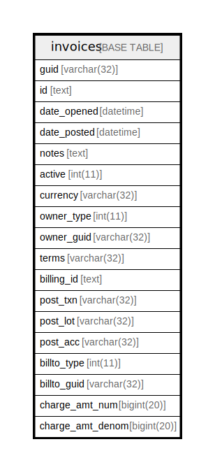

# invoices

## 概要

<details>
<summary><strong>テーブル定義</strong></summary>

```sql
CREATE TABLE `invoices` (
  `guid` text NOT NULL,
  `id` text NOT NULL,
  `date_opened` text DEFAULT NULL,
  `date_posted` text DEFAULT NULL,
  `notes` text NOT NULL,
  `active` int(11) NOT NULL,
  `currency` text NOT NULL,
  `owner_type` int(11) DEFAULT NULL,
  `owner_guid` text DEFAULT NULL,
  `terms` text DEFAULT NULL,
  `billing_id` text DEFAULT NULL,
  `post_txn` text DEFAULT NULL,
  `post_lot` text DEFAULT NULL,
  `post_acc` text DEFAULT NULL,
  `billto_type` int(11) DEFAULT NULL,
  `billto_guid` text DEFAULT NULL,
  `charge_amt_num` bigint(20) DEFAULT NULL,
  `charge_amt_denom` bigint(20) DEFAULT NULL,
  PRIMARY KEY (`guid`(255))
) ENGINE=InnoDB DEFAULT CHARSET=utf8mb4 COLLATE=utf8mb4_general_ci
```

</details>

## カラム一覧

| 名前               | タイプ        | デフォルト値       | NULL許可   | 子テーブル      | 親テーブル      | コメント     |
| ---------------- | ---------- | ------------ | -------- | ---------- | ---------- | -------- |
| guid             | text       |              | false    |            |            |          |
| id               | text       |              | false    |            |            |          |
| date_opened      | text       | NULL         | true     |            |            |          |
| date_posted      | text       | NULL         | true     |            |            |          |
| notes            | text       |              | false    |            |            |          |
| active           | int(11)    |              | false    |            |            |          |
| currency         | text       |              | false    |            |            |          |
| owner_type       | int(11)    | NULL         | true     |            |            |          |
| owner_guid       | text       | NULL         | true     |            |            |          |
| terms            | text       | NULL         | true     |            |            |          |
| billing_id       | text       | NULL         | true     |            |            |          |
| post_txn         | text       | NULL         | true     |            |            |          |
| post_lot         | text       | NULL         | true     |            |            |          |
| post_acc         | text       | NULL         | true     |            |            |          |
| billto_type      | int(11)    | NULL         | true     |            |            |          |
| billto_guid      | text       | NULL         | true     |            |            |          |
| charge_amt_num   | bigint(20) | NULL         | true     |            |            |          |
| charge_amt_denom | bigint(20) | NULL         | true     |            |            |          |

## 制約一覧

| 名前      | タイプ         | 定義                 |
| ------- | ----------- | ------------------ |
| PRIMARY | PRIMARY KEY | PRIMARY KEY (guid) |

## INDEX一覧

| 名前      | 定義                             |
| ------- | ------------------------------ |
| PRIMARY | PRIMARY KEY (guid) USING BTREE |

## ER図



---

> Generated by [tbls](https://github.com/k1LoW/tbls)
