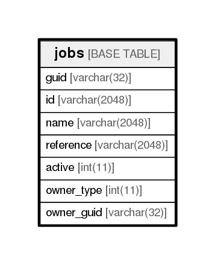

# jobs

## Description

<details>
<summary><strong>Table Definition</strong></summary>

```sql
CREATE TABLE `jobs` (
  `guid` varchar(32) NOT NULL,
  `id` varchar(2048) NOT NULL,
  `name` varchar(2048) NOT NULL,
  `reference` varchar(2048) NOT NULL,
  `active` int(11) NOT NULL,
  `owner_type` int(11) DEFAULT NULL,
  `owner_guid` varchar(32) DEFAULT NULL,
  PRIMARY KEY (`guid`)
) ENGINE=InnoDB DEFAULT CHARSET=utf8
```

</details>

## Columns

| Name       | Type          | Default | Nullable | Children | Parents | Comment |
| ---------- | ------------- | ------- | -------- | -------- | ------- | ------- |
| guid       | varchar(32)   |         | false    |          |         |         |
| id         | varchar(2048) |         | false    |          |         |         |
| name       | varchar(2048) |         | false    |          |         |         |
| reference  | varchar(2048) |         | false    |          |         |         |
| active     | int(11)       |         | false    |          |         |         |
| owner_type | int(11)       |         | true     |          |         |         |
| owner_guid | varchar(32)   |         | true     |          |         |         |

## Constraints

| Name    | Type        | Definition         |
| ------- | ----------- | ------------------ |
| PRIMARY | PRIMARY KEY | PRIMARY KEY (guid) |

## Indexes

| Name    | Definition                     |
| ------- | ------------------------------ |
| PRIMARY | PRIMARY KEY (guid) USING BTREE |

## Relations



---

> Generated by [tbls](https://github.com/k1LoW/tbls)
