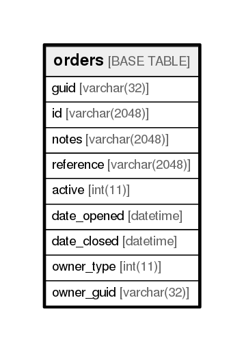

# orders

## Description

<details>
<summary><strong>Table Definition</strong></summary>

```sql
CREATE TABLE `orders` (
  `guid` varchar(32) NOT NULL,
  `id` varchar(2048) NOT NULL,
  `notes` varchar(2048) NOT NULL,
  `reference` varchar(2048) NOT NULL,
  `active` int(11) NOT NULL,
  `date_opened` datetime NOT NULL DEFAULT '1970-01-01 00:00:00',
  `date_closed` datetime NOT NULL DEFAULT '1970-01-01 00:00:00',
  `owner_type` int(11) NOT NULL,
  `owner_guid` varchar(32) NOT NULL,
  PRIMARY KEY (`guid`)
) ENGINE=InnoDB DEFAULT CHARSET=utf8
```

</details>

## Columns

| Name        | Type          | Default             | Nullable | Children | Parents | Comment |
| ----------- | ------------- | ------------------- | -------- | -------- | ------- | ------- |
| guid        | varchar(32)   |                     | false    |          |         |         |
| id          | varchar(2048) |                     | false    |          |         |         |
| notes       | varchar(2048) |                     | false    |          |         |         |
| reference   | varchar(2048) |                     | false    |          |         |         |
| active      | int(11)       |                     | false    |          |         |         |
| date_opened | datetime      | 1970-01-01 00:00:00 | false    |          |         |         |
| date_closed | datetime      | 1970-01-01 00:00:00 | false    |          |         |         |
| owner_type  | int(11)       |                     | false    |          |         |         |
| owner_guid  | varchar(32)   |                     | false    |          |         |         |

## Constraints

| Name    | Type        | Definition         |
| ------- | ----------- | ------------------ |
| PRIMARY | PRIMARY KEY | PRIMARY KEY (guid) |

## Indexes

| Name    | Definition                     |
| ------- | ------------------------------ |
| PRIMARY | PRIMARY KEY (guid) USING BTREE |

## Relations



---

> Generated by [tbls](https://github.com/k1LoW/tbls)
