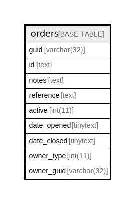

# orders

## 概要

<details>
<summary><strong>テーブル定義</strong></summary>

```sql
CREATE TABLE `orders` (
  `guid` text NOT NULL,
  `id` text NOT NULL,
  `notes` text NOT NULL,
  `reference` text NOT NULL,
  `active` int(11) NOT NULL,
  `date_opened` text NOT NULL,
  `date_closed` text NOT NULL,
  `owner_type` int(11) NOT NULL,
  `owner_guid` text NOT NULL,
  PRIMARY KEY (`guid`(255))
) ENGINE=InnoDB DEFAULT CHARSET=utf8mb4 COLLATE=utf8mb4_general_ci
```

</details>

## カラム一覧

| 名前          | タイプ     | デフォルト値       | NULL許可   | 子テーブル      | 親テーブル      | コメント     |
| ----------- | ------- | ------------ | -------- | ---------- | ---------- | -------- |
| guid        | text    |              | false    |            |            |          |
| id          | text    |              | false    |            |            |          |
| notes       | text    |              | false    |            |            |          |
| reference   | text    |              | false    |            |            |          |
| active      | int(11) |              | false    |            |            |          |
| date_opened | text    |              | false    |            |            |          |
| date_closed | text    |              | false    |            |            |          |
| owner_type  | int(11) |              | false    |            |            |          |
| owner_guid  | text    |              | false    |            |            |          |

## 制約一覧

| 名前      | タイプ         | 定義                 |
| ------- | ----------- | ------------------ |
| PRIMARY | PRIMARY KEY | PRIMARY KEY (guid) |

## INDEX一覧

| 名前      | 定義                             |
| ------- | ------------------------------ |
| PRIMARY | PRIMARY KEY (guid) USING BTREE |

## ER図



---

> Generated by [tbls](https://github.com/k1LoW/tbls)
