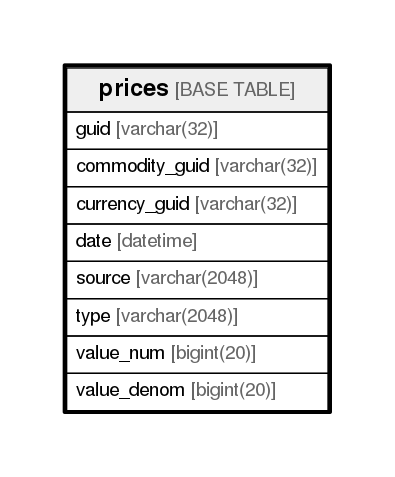

# prices

## Description

<details>
<summary><strong>Table Definition</strong></summary>

```sql
CREATE TABLE `prices` (
  `guid` varchar(32) NOT NULL,
  `commodity_guid` varchar(32) NOT NULL,
  `currency_guid` varchar(32) NOT NULL,
  `date` datetime NOT NULL DEFAULT '1970-01-01 00:00:00',
  `source` varchar(2048) DEFAULT NULL,
  `type` varchar(2048) DEFAULT NULL,
  `value_num` bigint(20) NOT NULL,
  `value_denom` bigint(20) NOT NULL,
  PRIMARY KEY (`guid`)
) ENGINE=InnoDB DEFAULT CHARSET=utf8
```

</details>

## Columns

| Name           | Type          | Default             | Nullable | Children | Parents | Comment |
| -------------- | ------------- | ------------------- | -------- | -------- | ------- | ------- |
| guid           | varchar(32)   |                     | false    |          |         |         |
| commodity_guid | varchar(32)   |                     | false    |          |         |         |
| currency_guid  | varchar(32)   |                     | false    |          |         |         |
| date           | datetime      | 1970-01-01 00:00:00 | false    |          |         |         |
| source         | varchar(2048) |                     | true     |          |         |         |
| type           | varchar(2048) |                     | true     |          |         |         |
| value_num      | bigint(20)    |                     | false    |          |         |         |
| value_denom    | bigint(20)    |                     | false    |          |         |         |

## Constraints

| Name    | Type        | Definition         |
| ------- | ----------- | ------------------ |
| PRIMARY | PRIMARY KEY | PRIMARY KEY (guid) |

## Indexes

| Name    | Definition                     |
| ------- | ------------------------------ |
| PRIMARY | PRIMARY KEY (guid) USING BTREE |

## Relations



---

> Generated by [tbls](https://github.com/k1LoW/tbls)
