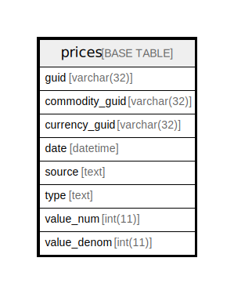

# prices

## 概要

<details>
<summary><strong>テーブル定義</strong></summary>

```sql
CREATE TABLE `prices` (
  `guid` text NOT NULL,
  `commodity_guid` text NOT NULL,
  `currency_guid` text NOT NULL,
  `date` text NOT NULL,
  `source` text DEFAULT NULL,
  `type` text DEFAULT NULL,
  `value_num` bigint(20) NOT NULL,
  `value_denom` bigint(20) NOT NULL,
  PRIMARY KEY (`guid`(255))
) ENGINE=InnoDB DEFAULT CHARSET=utf8mb4 COLLATE=utf8mb4_general_ci
```

</details>

## カラム一覧

| 名前             | タイプ        | デフォルト値       | NULL許可   | 子テーブル      | 親テーブル      | コメント     |
| -------------- | ---------- | ------------ | -------- | ---------- | ---------- | -------- |
| guid           | text       |              | false    |            |            |          |
| commodity_guid | text       |              | false    |            |            |          |
| currency_guid  | text       |              | false    |            |            |          |
| date           | text       |              | false    |            |            |          |
| source         | text       | NULL         | true     |            |            |          |
| type           | text       | NULL         | true     |            |            |          |
| value_num      | bigint(20) |              | false    |            |            |          |
| value_denom    | bigint(20) |              | false    |            |            |          |

## 制約一覧

| 名前      | タイプ         | 定義                 |
| ------- | ----------- | ------------------ |
| PRIMARY | PRIMARY KEY | PRIMARY KEY (guid) |

## INDEX一覧

| 名前      | 定義                             |
| ------- | ------------------------------ |
| PRIMARY | PRIMARY KEY (guid) USING BTREE |

## ER図



---

> Generated by [tbls](https://github.com/k1LoW/tbls)
