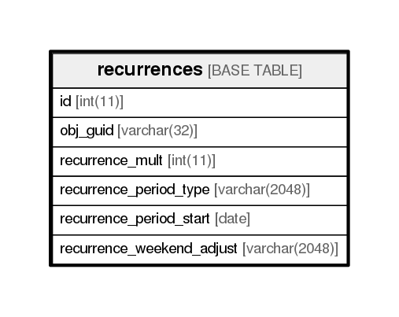

# recurrences

## Description

<details>
<summary><strong>Table Definition</strong></summary>

```sql
CREATE TABLE `recurrences` (
  `id` int(11) NOT NULL AUTO_INCREMENT,
  `obj_guid` varchar(32) NOT NULL,
  `recurrence_mult` int(11) NOT NULL,
  `recurrence_period_type` varchar(2048) NOT NULL,
  `recurrence_period_start` date NOT NULL,
  `recurrence_weekend_adjust` varchar(2048) NOT NULL,
  PRIMARY KEY (`id`)
) ENGINE=InnoDB DEFAULT CHARSET=utf8
```

</details>

## Columns

| Name                      | Type          | Default | Nullable | Children | Parents | Comment |
| ------------------------- | ------------- | ------- | -------- | -------- | ------- | ------- |
| id                        | int(11)       |         | false    |          |         |         |
| obj_guid                  | varchar(32)   |         | false    |          |         |         |
| recurrence_mult           | int(11)       |         | false    |          |         |         |
| recurrence_period_type    | varchar(2048) |         | false    |          |         |         |
| recurrence_period_start   | date          |         | false    |          |         |         |
| recurrence_weekend_adjust | varchar(2048) |         | false    |          |         |         |

## Constraints

| Name    | Type        | Definition       |
| ------- | ----------- | ---------------- |
| PRIMARY | PRIMARY KEY | PRIMARY KEY (id) |

## Indexes

| Name    | Definition                   |
| ------- | ---------------------------- |
| PRIMARY | PRIMARY KEY (id) USING BTREE |

## Relations



---

> Generated by [tbls](https://github.com/k1LoW/tbls)
