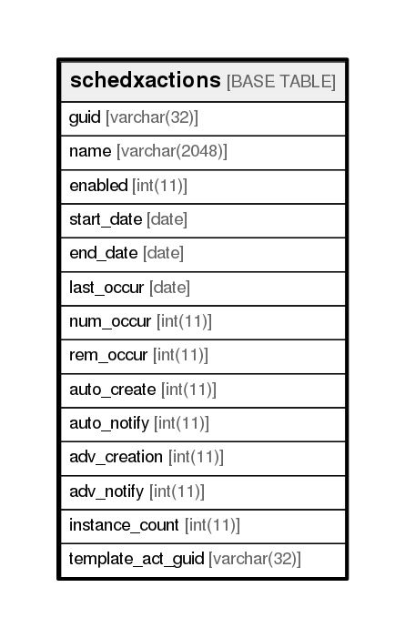

# schedxactions

## Description

<details>
<summary><strong>Table Definition</strong></summary>

```sql
CREATE TABLE `schedxactions` (
  `guid` varchar(32) NOT NULL,
  `name` varchar(2048) DEFAULT NULL,
  `enabled` int(11) NOT NULL,
  `start_date` date DEFAULT NULL,
  `end_date` date DEFAULT NULL,
  `last_occur` date DEFAULT NULL,
  `num_occur` int(11) NOT NULL,
  `rem_occur` int(11) NOT NULL,
  `auto_create` int(11) NOT NULL,
  `auto_notify` int(11) NOT NULL,
  `adv_creation` int(11) NOT NULL,
  `adv_notify` int(11) NOT NULL,
  `instance_count` int(11) NOT NULL,
  `template_act_guid` varchar(32) NOT NULL,
  PRIMARY KEY (`guid`)
) ENGINE=InnoDB DEFAULT CHARSET=utf8
```

</details>

## Columns

| Name              | Type          | Default | Nullable | Children | Parents | Comment |
| ----------------- | ------------- | ------- | -------- | -------- | ------- | ------- |
| guid              | varchar(32)   |         | false    |          |         |         |
| name              | varchar(2048) |         | true     |          |         |         |
| enabled           | int(11)       |         | false    |          |         |         |
| start_date        | date          |         | true     |          |         |         |
| end_date          | date          |         | true     |          |         |         |
| last_occur        | date          |         | true     |          |         |         |
| num_occur         | int(11)       |         | false    |          |         |         |
| rem_occur         | int(11)       |         | false    |          |         |         |
| auto_create       | int(11)       |         | false    |          |         |         |
| auto_notify       | int(11)       |         | false    |          |         |         |
| adv_creation      | int(11)       |         | false    |          |         |         |
| adv_notify        | int(11)       |         | false    |          |         |         |
| instance_count    | int(11)       |         | false    |          |         |         |
| template_act_guid | varchar(32)   |         | false    |          |         |         |

## Constraints

| Name    | Type        | Definition         |
| ------- | ----------- | ------------------ |
| PRIMARY | PRIMARY KEY | PRIMARY KEY (guid) |

## Indexes

| Name    | Definition                     |
| ------- | ------------------------------ |
| PRIMARY | PRIMARY KEY (guid) USING BTREE |

## Relations



---

> Generated by [tbls](https://github.com/k1LoW/tbls)
