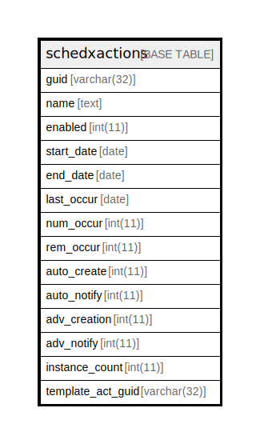

# schedxactions

## 概要

<details>
<summary><strong>テーブル定義</strong></summary>

```sql
CREATE TABLE `schedxactions` (
  `guid` text NOT NULL,
  `name` text DEFAULT NULL,
  `enabled` int(11) NOT NULL,
  `start_date` text DEFAULT NULL,
  `end_date` text DEFAULT NULL,
  `last_occur` text DEFAULT NULL,
  `num_occur` int(11) NOT NULL,
  `rem_occur` int(11) NOT NULL,
  `auto_create` int(11) NOT NULL,
  `auto_notify` int(11) NOT NULL,
  `adv_creation` int(11) NOT NULL,
  `adv_notify` int(11) NOT NULL,
  `instance_count` int(11) NOT NULL,
  `template_act_guid` text NOT NULL,
  PRIMARY KEY (`guid`(255))
) ENGINE=InnoDB DEFAULT CHARSET=utf8mb4 COLLATE=utf8mb4_general_ci
```

</details>

## カラム一覧

| 名前                | タイプ     | デフォルト値       | NULL許可   | 子テーブル      | 親テーブル      | コメント     |
| ----------------- | ------- | ------------ | -------- | ---------- | ---------- | -------- |
| guid              | text    |              | false    |            |            |          |
| name              | text    | NULL         | true     |            |            |          |
| enabled           | int(11) |              | false    |            |            |          |
| start_date        | text    | NULL         | true     |            |            |          |
| end_date          | text    | NULL         | true     |            |            |          |
| last_occur        | text    | NULL         | true     |            |            |          |
| num_occur         | int(11) |              | false    |            |            |          |
| rem_occur         | int(11) |              | false    |            |            |          |
| auto_create       | int(11) |              | false    |            |            |          |
| auto_notify       | int(11) |              | false    |            |            |          |
| adv_creation      | int(11) |              | false    |            |            |          |
| adv_notify        | int(11) |              | false    |            |            |          |
| instance_count    | int(11) |              | false    |            |            |          |
| template_act_guid | text    |              | false    |            |            |          |

## 制約一覧

| 名前      | タイプ         | 定義                 |
| ------- | ----------- | ------------------ |
| PRIMARY | PRIMARY KEY | PRIMARY KEY (guid) |

## INDEX一覧

| 名前      | 定義                             |
| ------- | ------------------------------ |
| PRIMARY | PRIMARY KEY (guid) USING BTREE |

## ER図



---

> Generated by [tbls](https://github.com/k1LoW/tbls)
