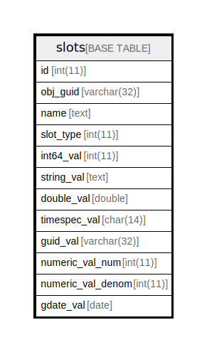

# slots

## 概要

<details>
<summary><strong>テーブル定義</strong></summary>

```sql
CREATE TABLE `slots` (
  `id` int(11) NOT NULL AUTO_INCREMENT,
  `obj_guid` varchar(32) NOT NULL,
  `name` text NOT NULL,
  `slot_type` int(11) NOT NULL,
  `int64_val` int(11) DEFAULT NULL,
  `string_val` text DEFAULT NULL,
  `double_val` double DEFAULT NULL,
  `timespec_val` char(14) DEFAULT NULL,
  `guid_val` varchar(32) DEFAULT NULL,
  `numeric_val_num` int(11) DEFAULT NULL,
  `numeric_val_denom` int(11) DEFAULT NULL,
  `gdate_val` date DEFAULT NULL,
  PRIMARY KEY (`id`)
) ENGINE=InnoDB DEFAULT CHARSET=utf8mb4 COLLATE=utf8mb4_general_ci
```

</details>

## カラム一覧

| 名前                | タイプ         | デフォルト値       | NULL許可   | Extra Definition | 子テーブル      | 親テーブル      | コメント     |
| ----------------- | ----------- | ------------ | -------- | ---------------- | ---------- | ---------- | -------- |
| id                | int(11)     |              | false    | auto_increment   |            |            |          |
| obj_guid          | varchar(32) |              | false    |                  |            |            |          |
| name              | text        |              | false    |                  |            |            |          |
| slot_type         | int(11)     |              | false    |                  |            |            |          |
| int64_val         | int(11)     | NULL         | true     |                  |            |            |          |
| string_val        | text        | NULL         | true     |                  |            |            |          |
| double_val        | double      | NULL         | true     |                  |            |            |          |
| timespec_val      | char(14)    | NULL         | true     |                  |            |            |          |
| guid_val          | varchar(32) | NULL         | true     |                  |            |            |          |
| numeric_val_num   | int(11)     | NULL         | true     |                  |            |            |          |
| numeric_val_denom | int(11)     | NULL         | true     |                  |            |            |          |
| gdate_val         | date        | NULL         | true     |                  |            |            |          |

## 制約一覧

| 名前      | タイプ         | 定義               |
| ------- | ----------- | ---------------- |
| PRIMARY | PRIMARY KEY | PRIMARY KEY (id) |

## INDEX一覧

| 名前      | 定義                           |
| ------- | ---------------------------- |
| PRIMARY | PRIMARY KEY (id) USING BTREE |

## ER図



---

> Generated by [tbls](https://github.com/k1LoW/tbls)
